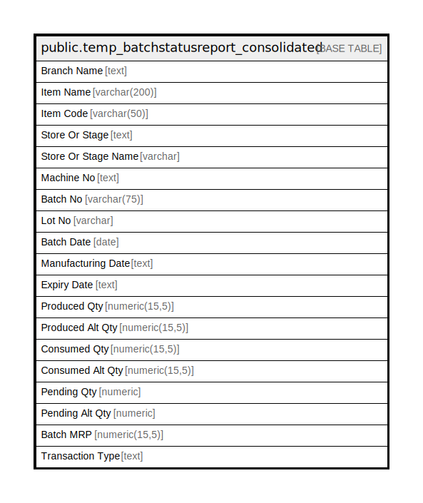

# public.temp_batchstatusreport_consolidated

## Description

## Columns

| Name | Type | Default | Nullable | Children | Parents | Comment |
| ---- | ---- | ------- | -------- | -------- | ------- | ------- |
| Branch Name | text |  | true |  |  |  |
| Item Name | varchar(200) |  | true |  |  |  |
| Item Code | varchar(50) |  | true |  |  |  |
| Store Or Stage | text |  | true |  |  |  |
| Store Or Stage Name | varchar |  | true |  |  |  |
| Machine No | text |  | true |  |  |  |
| Batch No | varchar(75) |  | true |  |  |  |
| Lot No | varchar |  | true |  |  |  |
| Batch Date | date |  | true |  |  |  |
| Manufacturing Date | text |  | true |  |  |  |
| Expiry Date | text |  | true |  |  |  |
| Produced Qty | numeric(15,5) |  | true |  |  |  |
| Produced Alt Qty | numeric(15,5) |  | true |  |  |  |
| Consumed Qty | numeric(15,5) |  | true |  |  |  |
| Consumed Alt Qty | numeric(15,5) |  | true |  |  |  |
| Pending Qty | numeric |  | true |  |  |  |
| Pending Alt Qty | numeric |  | true |  |  |  |
| Batch MRP | numeric(15,5) |  | true |  |  |  |
| Transaction Type | text |  | true |  |  |  |

## Relations

---

> Generated by [tbls](https://github.com/k1LoW/tbls)
