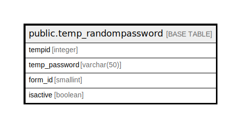

# public.temp_randompassword

## Description

## Columns

| Name | Type | Default | Nullable | Children | Parents | Comment |
| ---- | ---- | ------- | -------- | -------- | ------- | ------- |
| tempid | integer | nextval('temp_randompassword_tempid_seq'::regclass) | false |  |  |  |
| temp_password | varchar(50) |  | false |  |  |  |
| form_id | smallint |  | true |  |  |  |
| isactive | boolean | true | true |  |  |  |

## Relations

---

> Generated by [tbls](https://github.com/k1LoW/tbls)
