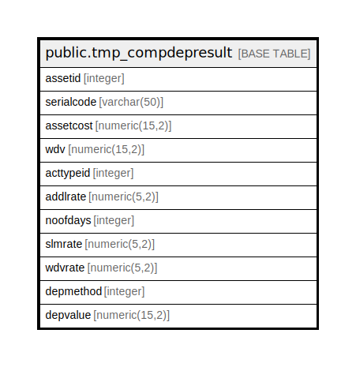

# public.tmp_compdepresult

## Description

## Columns

| Name | Type | Default | Nullable | Children | Parents | Comment |
| ---- | ---- | ------- | -------- | -------- | ------- | ------- |
| assetid | integer |  | true |  |  |  |
| serialcode | varchar(50) |  | true |  |  |  |
| assetcost | numeric(15,2) |  | true |  |  |  |
| wdv | numeric(15,2) |  | true |  |  |  |
| acttypeid | integer |  | true |  |  |  |
| addlrate | numeric(5,2) |  | true |  |  |  |
| noofdays | integer |  | true |  |  |  |
| slmrate | numeric(5,2) |  | true |  |  |  |
| wdvrate | numeric(5,2) |  | true |  |  |  |
| depmethod | integer |  | true |  |  |  |
| depvalue | numeric(15,2) |  | true |  |  |  |

## Relations

---

> Generated by [tbls](https://github.com/k1LoW/tbls)
