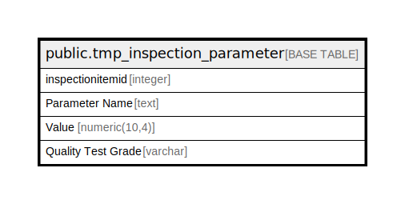

# public.tmp_inspection_parameter

## Description

## Columns

| Name | Type | Default | Nullable | Children | Parents | Comment |
| ---- | ---- | ------- | -------- | -------- | ------- | ------- |
| inspectionitemid | integer |  | true |  |  |  |
| Parameter Name | text |  | true |  |  |  |
| Value | numeric(10,4) |  | true |  |  |  |
| Quality Test Grade | varchar |  | true |  |  |  |

## Relations

---

> Generated by [tbls](https://github.com/k1LoW/tbls)
