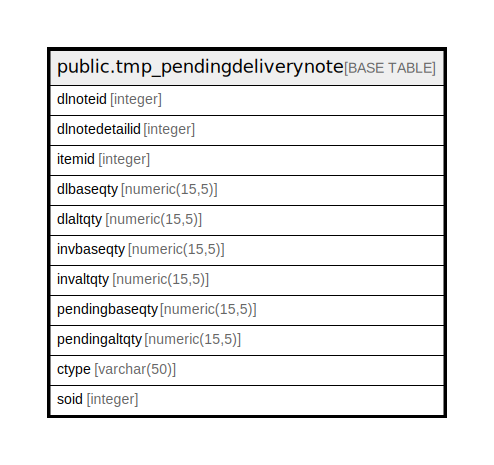

# public.tmp_pendingdeliverynote

## Description

## Columns

| Name | Type | Default | Nullable | Children | Parents | Comment |
| ---- | ---- | ------- | -------- | -------- | ------- | ------- |
| dlnoteid | integer |  | true |  |  |  |
| dlnotedetailid | integer |  | true |  |  |  |
| itemid | integer |  | true |  |  |  |
| dlbaseqty | numeric(15,5) | NULL::numeric | true |  |  |  |
| dlaltqty | numeric(15,5) | NULL::numeric | true |  |  |  |
| invbaseqty | numeric(15,5) | NULL::numeric | true |  |  |  |
| invaltqty | numeric(15,5) | NULL::numeric | true |  |  |  |
| pendingbaseqty | numeric(15,5) | NULL::numeric | true |  |  |  |
| pendingaltqty | numeric(15,5) | NULL::numeric | true |  |  |  |
| ctype | varchar(50) |  | true |  |  |  |
| soid | integer |  | true |  |  |  |

## Relations

---

> Generated by [tbls](https://github.com/k1LoW/tbls)
