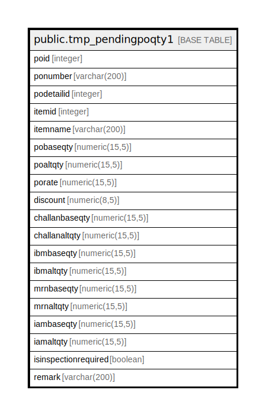

# public.tmp_pendingpoqty1

## Description

## Columns

| Name | Type | Default | Nullable | Children | Parents | Comment |
| ---- | ---- | ------- | -------- | -------- | ------- | ------- |
| poid | integer |  | true |  |  |  |
| ponumber | varchar(200) |  | true |  |  |  |
| podetailid | integer |  | true |  |  |  |
| itemid | integer |  | true |  |  |  |
| itemname | varchar(200) |  | true |  |  |  |
| pobaseqty | numeric(15,5) |  | true |  |  |  |
| poaltqty | numeric(15,5) |  | true |  |  |  |
| porate | numeric(15,5) |  | true |  |  |  |
| discount | numeric(8,5) |  | true |  |  |  |
| challanbaseqty | numeric(15,5) |  | true |  |  |  |
| challanaltqty | numeric(15,5) |  | true |  |  |  |
| ibmbaseqty | numeric(15,5) |  | true |  |  |  |
| ibmaltqty | numeric(15,5) |  | true |  |  |  |
| mrnbaseqty | numeric(15,5) |  | true |  |  |  |
| mrnaltqty | numeric(15,5) |  | true |  |  |  |
| iambaseqty | numeric(15,5) |  | true |  |  |  |
| iamaltqty | numeric(15,5) |  | true |  |  |  |
| isinspectionrequired | boolean |  | true |  |  |  |
| remark | varchar(200) |  | true |  |  |  |

## Relations

---

> Generated by [tbls](https://github.com/k1LoW/tbls)
