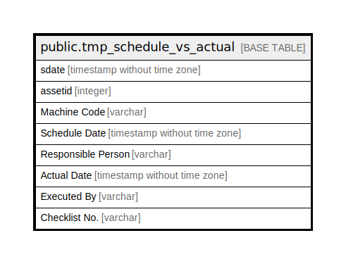

# public.tmp_schedule_vs_actual

## Description

## Columns

| Name | Type | Default | Nullable | Children | Parents | Comment |
| ---- | ---- | ------- | -------- | -------- | ------- | ------- |
| sdate | timestamp without time zone |  | true |  |  |  |
| assetid | integer |  | true |  |  |  |
| Machine Code | varchar |  | true |  |  |  |
| Schedule Date | timestamp without time zone |  | true |  |  |  |
| Responsible Person | varchar |  | true |  |  |  |
| Actual Date | timestamp without time zone |  | true |  |  |  |
| Executed By | varchar |  | true |  |  |  |
| Checklist No. | varchar |  | true |  |  |  |

## Relations

---

> Generated by [tbls](https://github.com/k1LoW/tbls)
