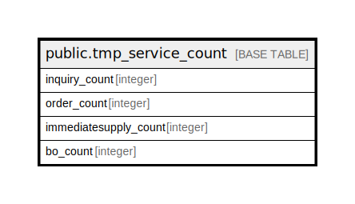

# public.tmp_service_count

## Description

## Columns

| Name | Type | Default | Nullable | Children | Parents | Comment |
| ---- | ---- | ------- | -------- | -------- | ------- | ------- |
| inquiry_count | integer |  | true |  |  |  |
| order_count | integer |  | true |  |  |  |
| immediatesupply_count | integer |  | true |  |  |  |
| bo_count | integer |  | true |  |  |  |

## Relations

---

> Generated by [tbls](https://github.com/k1LoW/tbls)
