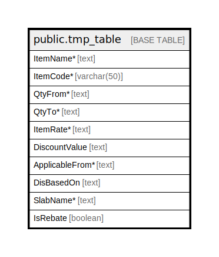

# public.tmp_table

## Description

## Columns

| Name | Type | Default | Nullable | Children | Parents | Comment |
| ---- | ---- | ------- | -------- | -------- | ------- | ------- |
| ItemName* | text |  | true |  |  |  |
| ItemCode* | varchar(50) |  | true |  |  |  |
| QtyFrom* | text |  | true |  |  |  |
| QtyTo* | text |  | true |  |  |  |
| ItemRate* | text |  | true |  |  |  |
| DiscountValue | text |  | true |  |  |  |
| ApplicableFrom* | text |  | true |  |  |  |
| DisBasedOn | text |  | true |  |  |  |
| SlabName* | text |  | true |  |  |  |
| IsRebate | boolean |  | true |  |  |  |

## Relations

---

> Generated by [tbls](https://github.com/k1LoW/tbls)
