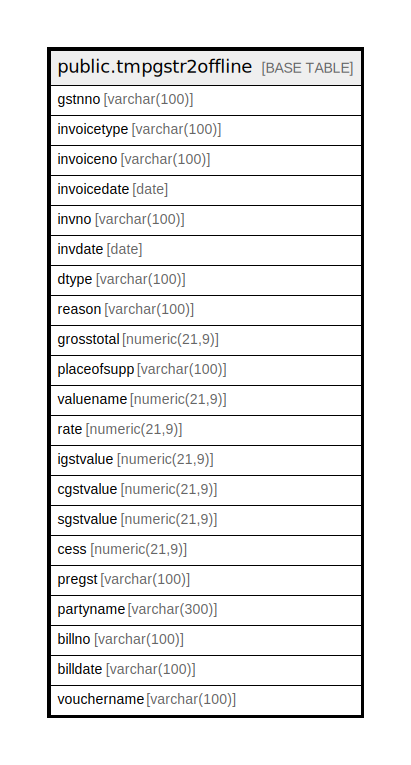

# public.tmpgstr2offline

## Description

## Columns

| Name | Type | Default | Nullable | Children | Parents | Comment |
| ---- | ---- | ------- | -------- | -------- | ------- | ------- |
| gstnno | varchar(100) |  | true |  |  |  |
| invoicetype | varchar(100) |  | true |  |  |  |
| invoiceno | varchar(100) |  | true |  |  |  |
| invoicedate | date |  | true |  |  |  |
| invno | varchar(100) |  | true |  |  |  |
| invdate | date |  | true |  |  |  |
| dtype | varchar(100) |  | true |  |  |  |
| reason | varchar(100) |  | true |  |  |  |
| grosstotal | numeric(21,9) |  | true |  |  |  |
| placeofsupp | varchar(100) |  | true |  |  |  |
| valuename | numeric(21,9) |  | true |  |  |  |
| rate | numeric(21,9) |  | true |  |  |  |
| igstvalue | numeric(21,9) |  | true |  |  |  |
| cgstvalue | numeric(21,9) |  | true |  |  |  |
| sgstvalue | numeric(21,9) |  | true |  |  |  |
| cess | numeric(21,9) |  | true |  |  |  |
| pregst | varchar(100) |  | true |  |  |  |
| partyname | varchar(300) |  | true |  |  |  |
| billno | varchar(100) |  | true |  |  |  |
| billdate | varchar(100) |  | true |  |  |  |
| vouchername | varchar(100) |  | true |  |  |  |

## Relations

---

> Generated by [tbls](https://github.com/k1LoW/tbls)
