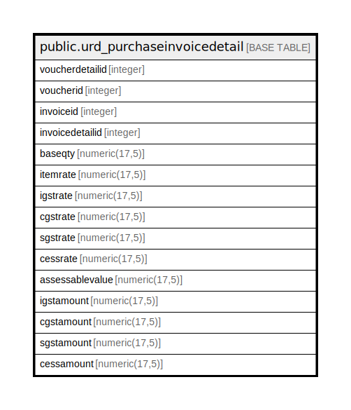

# public.urd_purchaseinvoicedetail

## Description

## Columns

| Name | Type | Default | Nullable | Children | Parents | Comment |
| ---- | ---- | ------- | -------- | -------- | ------- | ------- |
| voucherdetailid | integer | nextval('urd_purchaseinvoicedetail_voucherdetailid_seq'::regclass) | false |  |  |  |
| voucherid | integer |  | true |  |  |  |
| invoiceid | integer |  | true |  |  |  |
| invoicedetailid | integer |  | true |  |  |  |
| baseqty | numeric(17,5) | 0 | true |  |  |  |
| itemrate | numeric(17,5) | 0 | true |  |  |  |
| igstrate | numeric(17,5) | 0 | true |  |  |  |
| cgstrate | numeric(17,5) | 0 | true |  |  |  |
| sgstrate | numeric(17,5) | 0 | true |  |  |  |
| cessrate | numeric(17,5) | 0 | true |  |  |  |
| assessablevalue | numeric(17,5) | 0 | true |  |  |  |
| igstamount | numeric(17,5) | 0 | true |  |  |  |
| cgstamount | numeric(17,5) | 0 | true |  |  |  |
| sgstamount | numeric(17,5) | 0 | true |  |  |  |
| cessamount | numeric(17,5) | 0 | true |  |  |  |

## Relations

---

> Generated by [tbls](https://github.com/k1LoW/tbls)
