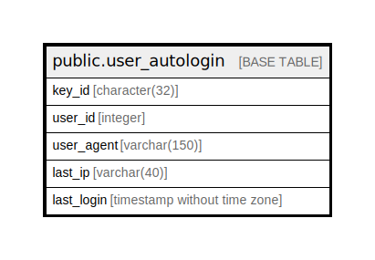

# public.user_autologin

## Description

## Columns

| Name | Type | Default | Nullable | Children | Parents | Comment |
| ---- | ---- | ------- | -------- | -------- | ------- | ------- |
| key_id | character(32) |  | false |  |  |  |
| user_id | integer | 0 | false |  |  |  |
| user_agent | varchar(150) |  | false |  |  |  |
| last_ip | varchar(40) |  | false |  |  |  |
| last_login | timestamp without time zone | '2010-09-22 16:58:15.98'::timestamp without time zone | false |  |  |  |

## Constraints

| Name | Type | Definition |
| ---- | ---- | ---------- |
| user_autologin_pkey | PRIMARY KEY | PRIMARY KEY (key_id, user_id) |

## Indexes

| Name | Definition |
| ---- | ---------- |
| user_autologin_pkey | CREATE UNIQUE INDEX user_autologin_pkey ON public.user_autologin USING btree (key_id, user_id) |

## Relations

---

> Generated by [tbls](https://github.com/k1LoW/tbls)
