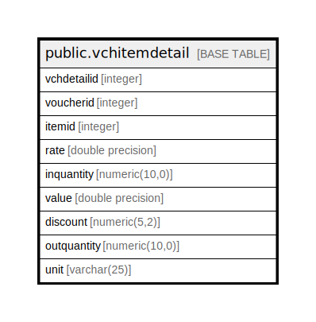

# public.vchitemdetail

## Description

## Columns

| Name | Type | Default | Nullable | Children | Parents | Comment |
| ---- | ---- | ------- | -------- | -------- | ------- | ------- |
| vchdetailid | integer | nextval('vchitemdetail_vchdetailid_seq'::regclass) | false |  |  |  |
| voucherid | integer |  | true |  |  |  |
| itemid | integer |  | true |  |  |  |
| rate | double precision | 0 | true |  |  |  |
| inquantity | numeric(10,0) | 0 | false |  |  |  |
| value | double precision | 0 | true |  |  |  |
| discount | numeric(5,2) |  | true |  |  |  |
| outquantity | numeric(10,0) | 0 | false |  |  |  |
| unit | varchar(25) |  | true |  |  |  |

## Constraints

| Name | Type | Definition |
| ---- | ---- | ---------- |
| vchitemdetail_pkey | PRIMARY KEY | PRIMARY KEY (vchdetailid) |

## Indexes

| Name | Definition |
| ---- | ---------- |
| vchitemdetail_pkey | CREATE UNIQUE INDEX vchitemdetail_pkey ON public.vchitemdetail USING btree (vchdetailid) |

## Relations

---

> Generated by [tbls](https://github.com/k1LoW/tbls)
