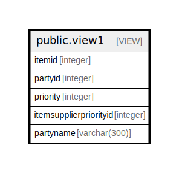

# public.view1

## Description

<details>
<summary><strong>Table Definition</strong></summary>

```sql
CREATE VIEW view1 AS (
 SELECT itemsupplierpriority.itemid,
    itemsupplierpriority.partyid,
    itemsupplierpriority.priority,
    itemsupplierpriority.itemsupplierpriorityid,
    partymaster.partyname
   FROM (comn_partymaster partymaster
     JOIN stor_itemsupplierpriority itemsupplierpriority ON ((partymaster.partyid = itemsupplierpriority.partyid)))
)
```

</details>

## Columns

| Name | Type | Default | Nullable | Children | Parents | Comment |
| ---- | ---- | ------- | -------- | -------- | ------- | ------- |
| itemid | integer |  | true |  |  |  |
| partyid | integer |  | true |  |  |  |
| priority | integer |  | true |  |  |  |
| itemsupplierpriorityid | integer |  | true |  |  |  |
| partyname | varchar(300) |  | true |  |  |  |

## Referenced Tables

| Name | Columns | Comment | Type |
| ---- | ------- | ------- | ---- |
| [public.comn_partymaster](public.comn_partymaster.md) | 120 |  | BASE TABLE |
| [public.stor_itemsupplierpriority](public.stor_itemsupplierpriority.md) | 6 |  | BASE TABLE |

## Relations



---

> Generated by [tbls](https://github.com/k1LoW/tbls)
