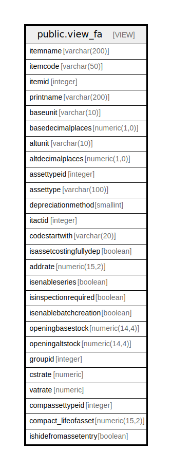

# public.view_fa

## Description

<details>
<summary><strong>Table Definition</strong></summary>

```sql
CREATE VIEW view_fa AS (
 SELECT itm.itemname,
    itm.itemcode,
    itm.itemid,
    itm.printname,
    uom.shortname AS baseunit,
    uom.noofdecimalplace_old AS basedecimalplaces,
    altuom.shortname AS altunit,
    altuom.noofdecimalplace_old AS altdecimalplaces,
    fasset.assettypeid,
    fasset.assettype,
    fasset.depreciationmethod,
    fasset.itactid,
    fasset.codestartwith,
    fasset.isassetcostingfullydep,
    fasset.addrate,
        CASE
            WHEN (itm.isenableseries IS NULL) THEN false
            ELSE itm.isenableseries
        END AS isenableseries,
    itm.isinspectionrequired,
    itm.isenablebatchcreation,
    itm.openingbasestock,
    itm.openingaltstock,
    itm.groupid,
    COALESCE(itm.cstrate, (0)::numeric) AS cstrate,
    COALESCE(itm.vatrate, (0)::numeric) AS vatrate,
    fasset.compassettypeid,
    compact.compact_lifeofasset,
    itm.ishidefromassetentry
   FROM ((((stor_itemmaster itm
     JOIN fa_assettypemaster fasset ON (((fasset.assettypeid = itm.assetstypeid) AND (itm.itemcategory = 5))))
     JOIN fa_companyact compact ON ((compact.acttypeid = fasset.compassettypeid)))
     JOIN stor_measurementunit uom ON ((uom.unitid = itm.unitid)))
     LEFT JOIN stor_measurementunit altuom ON ((altuom.unitid = itm.altunitid)))
)
```

</details>

## Columns

| Name | Type | Default | Nullable | Children | Parents | Comment |
| ---- | ---- | ------- | -------- | -------- | ------- | ------- |
| itemname | varchar(200) |  | true |  |  |  |
| itemcode | varchar(50) |  | true |  |  |  |
| itemid | integer |  | true |  |  |  |
| printname | varchar(200) |  | true |  |  |  |
| baseunit | varchar(10) |  | true |  |  |  |
| basedecimalplaces | numeric(1,0) |  | true |  |  |  |
| altunit | varchar(10) |  | true |  |  |  |
| altdecimalplaces | numeric(1,0) |  | true |  |  |  |
| assettypeid | integer |  | true |  |  |  |
| assettype | varchar(100) |  | true |  |  |  |
| depreciationmethod | smallint |  | true |  |  |  |
| itactid | integer |  | true |  |  |  |
| codestartwith | varchar(20) |  | true |  |  |  |
| isassetcostingfullydep | boolean |  | true |  |  |  |
| addrate | numeric(15,2) |  | true |  |  |  |
| isenableseries | boolean |  | true |  |  |  |
| isinspectionrequired | boolean |  | true |  |  |  |
| isenablebatchcreation | boolean |  | true |  |  |  |
| openingbasestock | numeric(14,4) |  | true |  |  |  |
| openingaltstock | numeric(14,4) |  | true |  |  |  |
| groupid | integer |  | true |  |  |  |
| cstrate | numeric |  | true |  |  |  |
| vatrate | numeric |  | true |  |  |  |
| compassettypeid | integer |  | true |  |  |  |
| compact_lifeofasset | numeric(15,2) |  | true |  |  |  |
| ishidefromassetentry | boolean |  | true |  |  |  |

## Referenced Tables

| Name | Columns | Comment | Type |
| ---- | ------- | ------- | ---- |
| [public.stor_itemmaster](public.stor_itemmaster.md) | 178 |  | BASE TABLE |
| [public.fa_assettypemaster](public.fa_assettypemaster.md) | 26 |  | BASE TABLE |
| [public.fa_companyact](public.fa_companyact.md) | 12 |  | BASE TABLE |
| [public.stor_measurementunit](public.stor_measurementunit.md) | 25 |  | BASE TABLE |

## Relations



---

> Generated by [tbls](https://github.com/k1LoW/tbls)
