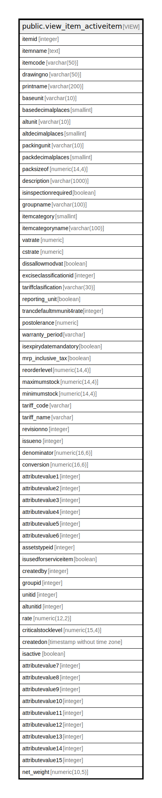

# public.view_item_activeitem

## Description

<details>
<summary><strong>Table Definition</strong></summary>

```sql
CREATE VIEW view_item_activeitem AS (
 SELECT itm.itemid,
        CASE
            WHEN (COALESCE(itm.isactive, false) = false) THEN ('[INACTIVE] '::text || (itm.itemname)::text)
            ELSE (
            CASE
                WHEN (COALESCE(itm.isauthorized, false) = false) THEN '[UNAUTHORIZED] '::text
                ELSE ''::text
            END || (itm.itemname)::text)
        END AS itemname,
    itm.itemcode,
    itm.drawingno,
    itm.printname,
    bunit.shortname AS baseunit,
    bunit.noofdecimalplace AS basedecimalplaces,
    aunit.shortname AS altunit,
    aunit.noofdecimalplace AS altdecimalplaces,
    pack.shortname AS packingunit,
    pack.noofdecimalplace AS packdecimalplaces,
    itm.packsizeof,
    itm.description,
    COALESCE(itm.isinspectionrequired, false) AS isinspectionrequired,
    grp.groupname,
    itm.itemcategory,
    svm.valuename AS itemcategoryname,
    COALESCE(itm.vatrate, 0.0) AS vatrate,
    COALESCE(itm.cstrate, 0.0) AS cstrate,
    COALESCE(itm.dissallowmodvat, false) AS dissallowmodvat,
    itm.exciseclassificationid,
    itm.tariffclasification,
    itm.reporting_unit,
    COALESCE((itm.trancdefaultmmunit4rate)::integer, 0) AS trancdefaultmmunit4rate,
    COALESCE(itm.postolerance, 0.0) AS postolerance,
    itm.warranty_period,
    COALESCE(itm.isexpirydatemandatory, false) AS isexpirydatemandatory,
    itm.mrp_inclusive_tax,
    itm.reorderlevel,
    itm.maximumstock,
    itm.minimumstock,
    tariff.code AS tariff_code,
    tariff.name AS tariff_name,
    itm.revisionno,
    itm.issueno,
    itm.denominator,
    itm.conversion,
    itm.attributevalue1,
    itm.attributevalue2,
    itm.attributevalue3,
    itm.attributevalue4,
    itm.attributevalue5,
    itm.attributevalue6,
    itm.assetstypeid,
    itm.isusedforserviceitem,
    itm.createdby,
    itm.groupid,
    itm.unitid,
    itm.altunitid,
    itm.rate,
    itm.criticalstocklevel,
    itm.createdon,
    itm.isactive,
    itm.attributevalue7,
    itm.attributevalue8,
    itm.attributevalue9,
    itm.attributevalue10,
    itm.attributevalue11,
    itm.attributevalue12,
    itm.attributevalue13,
    itm.attributevalue14,
    itm.attributevalue15,
    itm.net_weight
   FROM ((((((stor_itemmaster itm
     LEFT JOIN settingvaluemaster svm ON (((svm.settingvalueid = itm.itemcategory) AND (svm.settingid = 6))))
     LEFT JOIN stor_itemgroup grp ON ((grp.groupid = itm.groupid)))
     LEFT JOIN stor_measurementunit bunit ON ((itm.unitid = bunit.unitid)))
     LEFT JOIN stor_measurementunit aunit ON ((itm.altunitid = aunit.unitid)))
     LEFT JOIN stor_measurementunit pack ON ((itm.packinguomid = pack.unitid)))
     LEFT JOIN acc_exciseclassification tariff ON ((itm.exciseclassificationid = tariff.exciseclassificationid)))
  WHERE (itm.isactive = true)
)
```

</details>

## Columns

| Name | Type | Default | Nullable | Children | Parents | Comment |
| ---- | ---- | ------- | -------- | -------- | ------- | ------- |
| itemid | integer |  | true |  |  |  |
| itemname | text |  | true |  |  |  |
| itemcode | varchar(50) |  | true |  |  |  |
| drawingno | varchar(50) |  | true |  |  |  |
| printname | varchar(200) |  | true |  |  |  |
| baseunit | varchar(10) |  | true |  |  |  |
| basedecimalplaces | smallint |  | true |  |  |  |
| altunit | varchar(10) |  | true |  |  |  |
| altdecimalplaces | smallint |  | true |  |  |  |
| packingunit | varchar(10) |  | true |  |  |  |
| packdecimalplaces | smallint |  | true |  |  |  |
| packsizeof | numeric(14,4) |  | true |  |  |  |
| description | varchar(1000) |  | true |  |  |  |
| isinspectionrequired | boolean |  | true |  |  |  |
| groupname | varchar(100) |  | true |  |  |  |
| itemcategory | smallint |  | true |  |  |  |
| itemcategoryname | varchar(100) |  | true |  |  |  |
| vatrate | numeric |  | true |  |  |  |
| cstrate | numeric |  | true |  |  |  |
| dissallowmodvat | boolean |  | true |  |  |  |
| exciseclassificationid | integer |  | true |  |  |  |
| tariffclasification | varchar(30) |  | true |  |  |  |
| reporting_unit | boolean |  | true |  |  |  |
| trancdefaultmmunit4rate | integer |  | true |  |  |  |
| postolerance | numeric |  | true |  |  |  |
| warranty_period | varchar |  | true |  |  |  |
| isexpirydatemandatory | boolean |  | true |  |  |  |
| mrp_inclusive_tax | boolean |  | true |  |  |  |
| reorderlevel | numeric(14,4) |  | true |  |  |  |
| maximumstock | numeric(14,4) |  | true |  |  |  |
| minimumstock | numeric(14,4) |  | true |  |  |  |
| tariff_code | varchar |  | true |  |  |  |
| tariff_name | varchar |  | true |  |  |  |
| revisionno | integer |  | true |  |  |  |
| issueno | integer |  | true |  |  |  |
| denominator | numeric(16,6) |  | true |  |  |  |
| conversion | numeric(16,6) |  | true |  |  |  |
| attributevalue1 | integer |  | true |  |  |  |
| attributevalue2 | integer |  | true |  |  |  |
| attributevalue3 | integer |  | true |  |  |  |
| attributevalue4 | integer |  | true |  |  |  |
| attributevalue5 | integer |  | true |  |  |  |
| attributevalue6 | integer |  | true |  |  |  |
| assetstypeid | integer |  | true |  |  |  |
| isusedforserviceitem | boolean |  | true |  |  |  |
| createdby | integer |  | true |  |  |  |
| groupid | integer |  | true |  |  |  |
| unitid | integer |  | true |  |  |  |
| altunitid | integer |  | true |  |  |  |
| rate | numeric(12,2) |  | true |  |  |  |
| criticalstocklevel | numeric(15,4) |  | true |  |  |  |
| createdon | timestamp without time zone |  | true |  |  |  |
| isactive | boolean |  | true |  |  |  |
| attributevalue7 | integer |  | true |  |  |  |
| attributevalue8 | integer |  | true |  |  |  |
| attributevalue9 | integer |  | true |  |  |  |
| attributevalue10 | integer |  | true |  |  |  |
| attributevalue11 | integer |  | true |  |  |  |
| attributevalue12 | integer |  | true |  |  |  |
| attributevalue13 | integer |  | true |  |  |  |
| attributevalue14 | integer |  | true |  |  |  |
| attributevalue15 | integer |  | true |  |  |  |
| net_weight | numeric(10,5) |  | true |  |  |  |

## Referenced Tables

| Name | Columns | Comment | Type |
| ---- | ------- | ------- | ---- |
| [public.stor_itemmaster](public.stor_itemmaster.md) | 178 |  | BASE TABLE |
| [public.settingvaluemaster](public.settingvaluemaster.md) | 6 |  | BASE TABLE |
| [public.stor_itemgroup](public.stor_itemgroup.md) | 36 |  | BASE TABLE |
| [public.stor_measurementunit](public.stor_measurementunit.md) | 25 |  | BASE TABLE |
| [public.acc_exciseclassification](public.acc_exciseclassification.md) | 31 |  | BASE TABLE |

## Relations



---

> Generated by [tbls](https://github.com/k1LoW/tbls)
