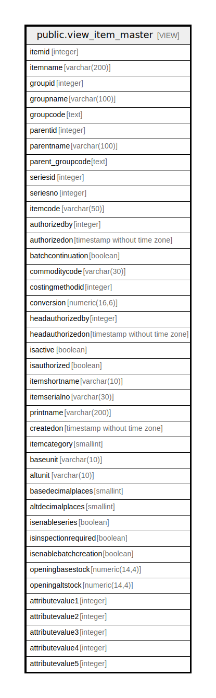

# public.view_item_master

## Description

<details>
<summary><strong>Table Definition</strong></summary>

```sql
CREATE VIEW view_item_master AS (
 SELECT itm.itemid,
    itm.itemname,
    itm.groupid,
    itg.groupname,
    itg.groupcode,
    itg.parentid,
    itg1.groupname AS parentname,
    itg1.groupcode AS parent_groupcode,
    itm.seriesid,
    itm.seriesno,
    itm.itemcode,
    itm.authorizedby,
    itm.authorizedon,
    itm.batchcontinuation,
    itm.commoditycode,
    itm.costingmethodid,
    itm.conversion,
    itm.headauthorizedby,
    itm.headauthorizedon,
    itm.isactive,
    itm.isauthorized,
    itm.itemshortname,
    itm.itemserialno,
    itm.printname,
    itm.createdon,
    itm.itemcategory,
    baseunitmaster.shortname AS baseunit,
    altunitmaster.shortname AS altunit,
    baseunitmaster.noofdecimalplace AS basedecimalplaces,
    altunitmaster.noofdecimalplace AS altdecimalplaces,
        CASE
            WHEN (itm.isenableseries IS NULL) THEN false
            ELSE itm.isenableseries
        END AS isenableseries,
    itm.isinspectionrequired,
    itm.isenablebatchcreation,
    itm.openingbasestock,
    itm.openingaltstock,
    itm.attributevalue1,
    itm.attributevalue2,
    itm.attributevalue3,
    itm.attributevalue4,
    itm.attributevalue5
   FROM ((((stor_itemmaster itm
     LEFT JOIN stor_itemgroup itg ON ((itm.groupid = itg.groupid)))
     LEFT JOIN stor_itemgroup itg1 ON ((itg.parentid = itg1.groupid)))
     LEFT JOIN stor_measurementunit baseunitmaster ON ((itm.unitid = baseunitmaster.unitid)))
     LEFT JOIN stor_measurementunit altunitmaster ON ((itm.altunitid = altunitmaster.unitid)))
  ORDER BY itm.itemid
)
```

</details>

## Columns

| Name | Type | Default | Nullable | Children | Parents | Comment |
| ---- | ---- | ------- | -------- | -------- | ------- | ------- |
| itemid | integer |  | true |  |  |  |
| itemname | varchar(200) |  | true |  |  |  |
| groupid | integer |  | true |  |  |  |
| groupname | varchar(100) |  | true |  |  |  |
| groupcode | text |  | true |  |  |  |
| parentid | integer |  | true |  |  |  |
| parentname | varchar(100) |  | true |  |  |  |
| parent_groupcode | text |  | true |  |  |  |
| seriesid | integer |  | true |  |  |  |
| seriesno | integer |  | true |  |  |  |
| itemcode | varchar(50) |  | true |  |  |  |
| authorizedby | integer |  | true |  |  |  |
| authorizedon | timestamp without time zone |  | true |  |  |  |
| batchcontinuation | boolean |  | true |  |  |  |
| commoditycode | varchar(30) |  | true |  |  |  |
| costingmethodid | integer |  | true |  |  |  |
| conversion | numeric(16,6) |  | true |  |  |  |
| headauthorizedby | integer |  | true |  |  |  |
| headauthorizedon | timestamp without time zone |  | true |  |  |  |
| isactive | boolean |  | true |  |  |  |
| isauthorized | boolean |  | true |  |  |  |
| itemshortname | varchar(10) |  | true |  |  |  |
| itemserialno | varchar(30) |  | true |  |  |  |
| printname | varchar(200) |  | true |  |  |  |
| createdon | timestamp without time zone |  | true |  |  |  |
| itemcategory | smallint |  | true |  |  |  |
| baseunit | varchar(10) |  | true |  |  |  |
| altunit | varchar(10) |  | true |  |  |  |
| basedecimalplaces | smallint |  | true |  |  |  |
| altdecimalplaces | smallint |  | true |  |  |  |
| isenableseries | boolean |  | true |  |  |  |
| isinspectionrequired | boolean |  | true |  |  |  |
| isenablebatchcreation | boolean |  | true |  |  |  |
| openingbasestock | numeric(14,4) |  | true |  |  |  |
| openingaltstock | numeric(14,4) |  | true |  |  |  |
| attributevalue1 | integer |  | true |  |  |  |
| attributevalue2 | integer |  | true |  |  |  |
| attributevalue3 | integer |  | true |  |  |  |
| attributevalue4 | integer |  | true |  |  |  |
| attributevalue5 | integer |  | true |  |  |  |

## Referenced Tables

| Name | Columns | Comment | Type |
| ---- | ------- | ------- | ---- |
| [public.stor_itemmaster](public.stor_itemmaster.md) | 178 |  | BASE TABLE |
| [public.stor_itemgroup](public.stor_itemgroup.md) | 36 |  | BASE TABLE |
| [public.stor_measurementunit](public.stor_measurementunit.md) | 25 |  | BASE TABLE |

## Relations



---

> Generated by [tbls](https://github.com/k1LoW/tbls)
