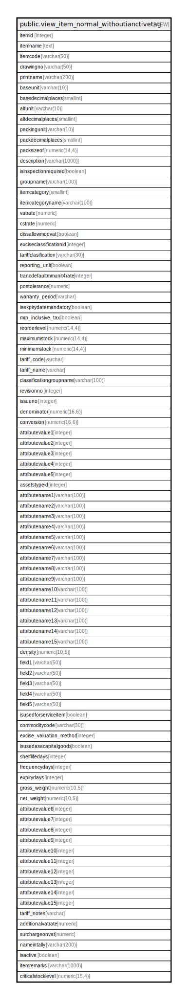

# public.view_item_normal_withoutianctivetag

## Description

<details>
<summary><strong>Table Definition</strong></summary>

```sql
CREATE VIEW view_item_normal_withoutianctivetag AS (
 SELECT itm.itemid,
    (
        CASE
            WHEN (COALESCE(itm.isauthorized, false) = false) THEN '[UNAUTHORIZED] '::text
            ELSE ''::text
        END || (itm.itemname)::text) AS itemname,
    itm.itemcode,
    itm.drawingno,
    itm.printname,
    bunit.shortname AS baseunit,
    bunit.noofdecimalplace AS basedecimalplaces,
    aunit.shortname AS altunit,
    aunit.noofdecimalplace AS altdecimalplaces,
    pack.shortname AS packingunit,
    pack.noofdecimalplace AS packdecimalplaces,
    itm.packsizeof,
    itm.description,
    COALESCE(itm.isinspectionrequired, false) AS isinspectionrequired,
    grp.groupname,
    itm.itemcategory,
    svm.valuename AS itemcategoryname,
    COALESCE(itm.vatrate, 0.0) AS vatrate,
    COALESCE(itm.cstrate, 0.0) AS cstrate,
    COALESCE(itm.dissallowmodvat, false) AS dissallowmodvat,
    itm.exciseclassificationid,
    itm.tariffclasification,
    itm.reporting_unit,
    COALESCE((itm.trancdefaultmmunit4rate)::integer, 0) AS trancdefaultmmunit4rate,
    COALESCE(itm.postolerance, 0.0) AS postolerance,
    itm.warranty_period,
    COALESCE(itm.isexpirydatemandatory, false) AS isexpirydatemandatory,
    itm.mrp_inclusive_tax,
    itm.reorderlevel,
    itm.maximumstock,
    itm.minimumstock,
    tariff.code AS tariff_code,
    tariff.name AS tariff_name,
    tariff.classificationgroupname,
    itm.revisionno,
    itm.issueno,
    itm.denominator,
    itm.conversion,
    itm.attributevalue1,
    itm.attributevalue2,
    itm.attributevalue3,
    itm.attributevalue4,
    itm.attributevalue5,
    itm.assetstypeid,
    attrib1.valuename AS attributename1,
    attrib2.valuename AS attributename2,
    attrib3.valuename AS attributename3,
    attrib4.valuename AS attributename4,
    attrib5.valuename AS attributename5,
    attrib6.valuename AS attributename6,
    attrib7.valuename AS attributename7,
    attrib8.valuename AS attributename8,
    attrib9.valuename AS attributename9,
    attrib10.valuename AS attributename10,
    attrib11.valuename AS attributename11,
    attrib12.valuename AS attributename12,
    attrib13.valuename AS attributename13,
    attrib14.valuename AS attributename14,
    attrib15.valuename AS attributename15,
    itm.density,
    itm.field1,
    itm.field2,
    itm.field3,
    itm.field4,
    itm.field5,
    itm.isusedforserviceitem,
    itm.commoditycode,
    itm.excise_valuation_method,
    itm.isusedasacapitalgoods,
    itm.shelflifedays,
    itm.frequencydays,
    itm.expirydays,
    itm.gross_weight,
    itm.net_weight,
    itm.attributevalue6,
    itm.attributevalue7,
    itm.attributevalue8,
    itm.attributevalue9,
    itm.attributevalue10,
    itm.attributevalue11,
    itm.attributevalue12,
    itm.attributevalue13,
    itm.attributevalue14,
    itm.attributevalue15,
    tariff.notes AS tariff_notes,
    COALESCE(itm.additionalvatrate, 0.0) AS additionalvatrate,
    COALESCE(itm.surchargeonvat, 0.0) AS surchargeonvat,
    COALESCE(itm.nameintally, itm.printname) AS nameintally,
    itm.isactive,
    itm.remark AS itemremarks,
    itm.criticalstocklevel
   FROM (((((((((((((((((((((stor_itemmaster itm
     LEFT JOIN settingvaluemaster svm ON (((svm.settingvalueid = itm.itemcategory) AND (svm.settingid = 6))))
     LEFT JOIN stor_itemgroup grp ON ((grp.groupid = itm.groupid)))
     LEFT JOIN stor_measurementunit bunit ON ((itm.unitid = bunit.unitid)))
     LEFT JOIN stor_measurementunit aunit ON ((itm.altunitid = aunit.unitid)))
     LEFT JOIN stor_measurementunit pack ON ((itm.packinguomid = pack.unitid)))
     LEFT JOIN acc_exciseclassification tariff ON ((itm.exciseclassificationid = tariff.exciseclassificationid)))
     LEFT JOIN stor_itemattributevalue attrib1 ON (((attrib1.attributevalueid = itm.attributevalue1) AND (attrib1.attributeid = 1))))
     LEFT JOIN stor_itemattributevalue attrib2 ON (((attrib2.attributevalueid = itm.attributevalue2) AND (attrib2.attributeid = 2))))
     LEFT JOIN stor_itemattributevalue attrib3 ON (((attrib3.attributevalueid = itm.attributevalue3) AND (attrib3.attributeid = 3))))
     LEFT JOIN stor_itemattributevalue attrib4 ON (((attrib4.attributevalueid = itm.attributevalue4) AND (attrib4.attributeid = 4))))
     LEFT JOIN stor_itemattributevalue attrib5 ON (((attrib5.attributevalueid = itm.attributevalue5) AND (attrib5.attributeid = 5))))
     LEFT JOIN stor_itemattributevalue attrib6 ON (((attrib6.attributevalueid = itm.attributevalue6) AND (attrib6.attributeid = 6))))
     LEFT JOIN stor_itemattributevalue attrib7 ON (((attrib7.attributevalueid = itm.attributevalue7) AND (attrib7.attributeid = 7))))
     LEFT JOIN stor_itemattributevalue attrib8 ON (((attrib8.attributevalueid = itm.attributevalue8) AND (attrib8.attributeid = 8))))
     LEFT JOIN stor_itemattributevalue attrib9 ON (((attrib9.attributevalueid = itm.attributevalue9) AND (attrib9.attributeid = 9))))
     LEFT JOIN stor_itemattributevalue attrib10 ON (((attrib10.attributevalueid = itm.attributevalue10) AND (attrib10.attributeid = 10))))
     LEFT JOIN stor_itemattributevalue attrib11 ON (((attrib11.attributevalueid = itm.attributevalue11) AND (attrib11.attributeid = 11))))
     LEFT JOIN stor_itemattributevalue attrib12 ON (((attrib12.attributevalueid = itm.attributevalue12) AND (attrib12.attributeid = 12))))
     LEFT JOIN stor_itemattributevalue attrib13 ON (((attrib13.attributevalueid = itm.attributevalue13) AND (attrib13.attributeid = 13))))
     LEFT JOIN stor_itemattributevalue attrib14 ON (((attrib14.attributevalueid = itm.attributevalue14) AND (attrib14.attributeid = 14))))
     LEFT JOIN stor_itemattributevalue attrib15 ON (((attrib15.attributevalueid = itm.attributevalue15) AND (attrib15.attributeid = 15))))
)
```

</details>

## Columns

| Name | Type | Default | Nullable | Children | Parents | Comment |
| ---- | ---- | ------- | -------- | -------- | ------- | ------- |
| itemid | integer |  | true |  |  |  |
| itemname | text |  | true |  |  |  |
| itemcode | varchar(50) |  | true |  |  |  |
| drawingno | varchar(50) |  | true |  |  |  |
| printname | varchar(200) |  | true |  |  |  |
| baseunit | varchar(10) |  | true |  |  |  |
| basedecimalplaces | smallint |  | true |  |  |  |
| altunit | varchar(10) |  | true |  |  |  |
| altdecimalplaces | smallint |  | true |  |  |  |
| packingunit | varchar(10) |  | true |  |  |  |
| packdecimalplaces | smallint |  | true |  |  |  |
| packsizeof | numeric(14,4) |  | true |  |  |  |
| description | varchar(1000) |  | true |  |  |  |
| isinspectionrequired | boolean |  | true |  |  |  |
| groupname | varchar(100) |  | true |  |  |  |
| itemcategory | smallint |  | true |  |  |  |
| itemcategoryname | varchar(100) |  | true |  |  |  |
| vatrate | numeric |  | true |  |  |  |
| cstrate | numeric |  | true |  |  |  |
| dissallowmodvat | boolean |  | true |  |  |  |
| exciseclassificationid | integer |  | true |  |  |  |
| tariffclasification | varchar(30) |  | true |  |  |  |
| reporting_unit | boolean |  | true |  |  |  |
| trancdefaultmmunit4rate | integer |  | true |  |  |  |
| postolerance | numeric |  | true |  |  |  |
| warranty_period | varchar |  | true |  |  |  |
| isexpirydatemandatory | boolean |  | true |  |  |  |
| mrp_inclusive_tax | boolean |  | true |  |  |  |
| reorderlevel | numeric(14,4) |  | true |  |  |  |
| maximumstock | numeric(14,4) |  | true |  |  |  |
| minimumstock | numeric(14,4) |  | true |  |  |  |
| tariff_code | varchar |  | true |  |  |  |
| tariff_name | varchar |  | true |  |  |  |
| classificationgroupname | varchar(100) |  | true |  |  |  |
| revisionno | integer |  | true |  |  |  |
| issueno | integer |  | true |  |  |  |
| denominator | numeric(16,6) |  | true |  |  |  |
| conversion | numeric(16,6) |  | true |  |  |  |
| attributevalue1 | integer |  | true |  |  |  |
| attributevalue2 | integer |  | true |  |  |  |
| attributevalue3 | integer |  | true |  |  |  |
| attributevalue4 | integer |  | true |  |  |  |
| attributevalue5 | integer |  | true |  |  |  |
| assetstypeid | integer |  | true |  |  |  |
| attributename1 | varchar(100) |  | true |  |  |  |
| attributename2 | varchar(100) |  | true |  |  |  |
| attributename3 | varchar(100) |  | true |  |  |  |
| attributename4 | varchar(100) |  | true |  |  |  |
| attributename5 | varchar(100) |  | true |  |  |  |
| attributename6 | varchar(100) |  | true |  |  |  |
| attributename7 | varchar(100) |  | true |  |  |  |
| attributename8 | varchar(100) |  | true |  |  |  |
| attributename9 | varchar(100) |  | true |  |  |  |
| attributename10 | varchar(100) |  | true |  |  |  |
| attributename11 | varchar(100) |  | true |  |  |  |
| attributename12 | varchar(100) |  | true |  |  |  |
| attributename13 | varchar(100) |  | true |  |  |  |
| attributename14 | varchar(100) |  | true |  |  |  |
| attributename15 | varchar(100) |  | true |  |  |  |
| density | numeric(10,5) |  | true |  |  |  |
| field1 | varchar(50) |  | true |  |  |  |
| field2 | varchar(50) |  | true |  |  |  |
| field3 | varchar(50) |  | true |  |  |  |
| field4 | varchar(50) |  | true |  |  |  |
| field5 | varchar(50) |  | true |  |  |  |
| isusedforserviceitem | boolean |  | true |  |  |  |
| commoditycode | varchar(30) |  | true |  |  |  |
| excise_valuation_method | integer |  | true |  |  |  |
| isusedasacapitalgoods | boolean |  | true |  |  |  |
| shelflifedays | integer |  | true |  |  |  |
| frequencydays | integer |  | true |  |  |  |
| expirydays | integer |  | true |  |  |  |
| gross_weight | numeric(10,5) |  | true |  |  |  |
| net_weight | numeric(10,5) |  | true |  |  |  |
| attributevalue6 | integer |  | true |  |  |  |
| attributevalue7 | integer |  | true |  |  |  |
| attributevalue8 | integer |  | true |  |  |  |
| attributevalue9 | integer |  | true |  |  |  |
| attributevalue10 | integer |  | true |  |  |  |
| attributevalue11 | integer |  | true |  |  |  |
| attributevalue12 | integer |  | true |  |  |  |
| attributevalue13 | integer |  | true |  |  |  |
| attributevalue14 | integer |  | true |  |  |  |
| attributevalue15 | integer |  | true |  |  |  |
| tariff_notes | varchar |  | true |  |  |  |
| additionalvatrate | numeric |  | true |  |  |  |
| surchargeonvat | numeric |  | true |  |  |  |
| nameintally | varchar(200) |  | true |  |  |  |
| isactive | boolean |  | true |  |  |  |
| itemremarks | varchar(1000) |  | true |  |  |  |
| criticalstocklevel | numeric(15,4) |  | true |  |  |  |

## Referenced Tables

| Name | Columns | Comment | Type |
| ---- | ------- | ------- | ---- |
| [public.stor_itemmaster](public.stor_itemmaster.md) | 178 |  | BASE TABLE |
| [public.settingvaluemaster](public.settingvaluemaster.md) | 6 |  | BASE TABLE |
| [public.stor_itemgroup](public.stor_itemgroup.md) | 36 |  | BASE TABLE |
| [public.stor_measurementunit](public.stor_measurementunit.md) | 25 |  | BASE TABLE |
| [public.acc_exciseclassification](public.acc_exciseclassification.md) | 31 |  | BASE TABLE |
| [public.stor_itemattributevalue](public.stor_itemattributevalue.md) | 11 |  | BASE TABLE |

## Relations



---

> Generated by [tbls](https://github.com/k1LoW/tbls)
