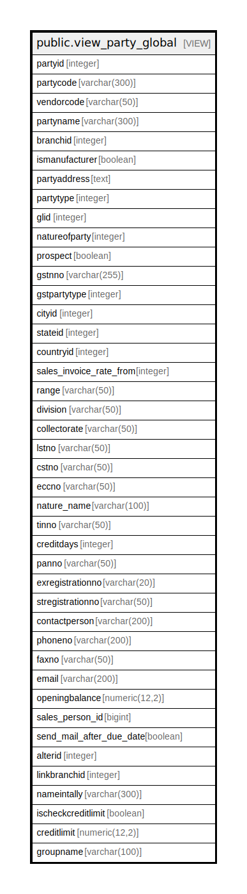

# public.view_party_global

## Description

<details>
<summary><strong>Table Definition</strong></summary>

```sql
CREATE VIEW view_party_global AS (
 SELECT pm.partyid,
    pm.partycode,
    pm.vendorcode,
    pm.partyname,
    pb.branchid,
    pm.ismanufacturer,
    ((((COALESCE(((pm.address)::text || chr(13)), ''::text) || COALESCE(((','::text || (cm.cityname)::text) || chr(13)), ''::text)) || COALESCE((','::text || (sm.statename)::text), (''::character varying)::text)) || COALESCE((','::text || (cmm.countryname)::text), (''::character varying)::text)) || COALESCE((','::text || (pm.pincode)::text), (''::character varying)::text)) AS partyaddress,
    pm.partytype,
    pm.glid,
    pm.natureofparty,
    pm.prospect,
    pm.gstnno,
    pm.gstpartytype,
    cm.cityid,
    sm.stateid,
    cmm.countryid,
    pm.sales_invoice_rate_from,
    pm.range,
    pm.division,
    pm.collectorate,
    pm.lstno,
    pm.cstno,
    pm.eccno,
    np.valuename AS nature_name,
    pm.tinno,
    pm.creditdays,
    pm.panno,
    pm.exregistrationno,
    pm.stregistrationno,
    pm.contactperson,
    pm.phoneno,
    pm.faxno,
    pm.email,
    pm.openingbalance,
    pm.sales_person_id,
    pm.send_mail_after_due_date,
    pm.alterid,
    pm.linkbranchid,
    COALESCE(pm.partynameintally, pm.partyname) AS nameintally,
    pm.ischeckcreditlimit,
    pm.creditlimit,
    cpg.groupname
   FROM ((((((comn_partymaster pm
     LEFT JOIN comn_citymaster cm ON (((pm.cityid = cm.cityid) AND ((cm.cityname)::text <> 'None'::text))))
     LEFT JOIN comn_statemaster sm ON (((pm.stateid = sm.stateid) AND ((sm.statename)::text <> 'None'::text))))
     LEFT JOIN comn_countrymaster cmm ON (((pm.countryid = cmm.countryid) AND ((cmm.countryname)::text <> 'None'::text))))
     LEFT JOIN ( SELECT DISTINCT comn_partybelongstobranch.branchid,
            comn_partybelongstobranch.partyid
           FROM comn_partybelongstobranch
          WHERE (comn_partybelongstobranch.isactive = true)
          ORDER BY comn_partybelongstobranch.branchid, comn_partybelongstobranch.partyid) pb ON ((pb.partyid = pm.partyid)))
     LEFT JOIN ( SELECT settingvaluemaster.settingid,
            settingvaluemaster.settingvalueid,
            settingvaluemaster.valuename,
            settingvaluemaster.settingcode,
            settingvaluemaster.lastupdatedon,
            settingvaluemaster.isactive
           FROM settingvaluemaster
          WHERE (settingvaluemaster.settingid = 26)) np ON ((np.settingvalueid = pm.natureofparty)))
     LEFT JOIN comn_partygroup cpg ON ((cpg.groupid = pm.groupid)))
  WHERE ((pm.isactive = true) AND (pm.isauthorized = true))
)
```

</details>

## Columns

| Name | Type | Default | Nullable | Children | Parents | Comment |
| ---- | ---- | ------- | -------- | -------- | ------- | ------- |
| partyid | integer |  | true |  |  |  |
| partycode | varchar(300) |  | true |  |  |  |
| vendorcode | varchar(50) |  | true |  |  |  |
| partyname | varchar(300) |  | true |  |  |  |
| branchid | integer |  | true |  |  |  |
| ismanufacturer | boolean |  | true |  |  |  |
| partyaddress | text |  | true |  |  |  |
| partytype | integer |  | true |  |  |  |
| glid | integer |  | true |  |  |  |
| natureofparty | integer |  | true |  |  |  |
| prospect | boolean |  | true |  |  |  |
| gstnno | varchar(255) |  | true |  |  |  |
| gstpartytype | integer |  | true |  |  |  |
| cityid | integer |  | true |  |  |  |
| stateid | integer |  | true |  |  |  |
| countryid | integer |  | true |  |  |  |
| sales_invoice_rate_from | integer |  | true |  |  |  |
| range | varchar(50) |  | true |  |  |  |
| division | varchar(50) |  | true |  |  |  |
| collectorate | varchar(50) |  | true |  |  |  |
| lstno | varchar(50) |  | true |  |  |  |
| cstno | varchar(50) |  | true |  |  |  |
| eccno | varchar(50) |  | true |  |  |  |
| nature_name | varchar(100) |  | true |  |  |  |
| tinno | varchar(50) |  | true |  |  |  |
| creditdays | integer |  | true |  |  |  |
| panno | varchar(50) |  | true |  |  |  |
| exregistrationno | varchar(20) |  | true |  |  |  |
| stregistrationno | varchar(50) |  | true |  |  |  |
| contactperson | varchar(200) |  | true |  |  |  |
| phoneno | varchar(200) |  | true |  |  |  |
| faxno | varchar(50) |  | true |  |  |  |
| email | varchar(200) |  | true |  |  |  |
| openingbalance | numeric(12,2) |  | true |  |  |  |
| sales_person_id | bigint |  | true |  |  |  |
| send_mail_after_due_date | boolean |  | true |  |  |  |
| alterid | integer |  | true |  |  |  |
| linkbranchid | integer |  | true |  |  |  |
| nameintally | varchar(300) |  | true |  |  |  |
| ischeckcreditlimit | boolean |  | true |  |  |  |
| creditlimit | numeric(12,2) |  | true |  |  |  |
| groupname | varchar(100) |  | true |  |  |  |

## Referenced Tables

| Name | Columns | Comment | Type |
| ---- | ------- | ------- | ---- |
| [public.comn_partymaster](public.comn_partymaster.md) | 120 |  | BASE TABLE |
| [public.comn_citymaster](public.comn_citymaster.md) | 13 |  | BASE TABLE |
| [public.comn_statemaster](public.comn_statemaster.md) | 14 |  | BASE TABLE |
| [public.comn_countrymaster](public.comn_countrymaster.md) | 12 |  | BASE TABLE |
| [public.comn_partybelongstobranch](public.comn_partybelongstobranch.md) | 13 |  | BASE TABLE |
| [public.settingvaluemaster](public.settingvaluemaster.md) | 6 |  | BASE TABLE |
| [public.comn_partygroup](public.comn_partygroup.md) | 19 |  | BASE TABLE |

## Relations



---

> Generated by [tbls](https://github.com/k1LoW/tbls)
