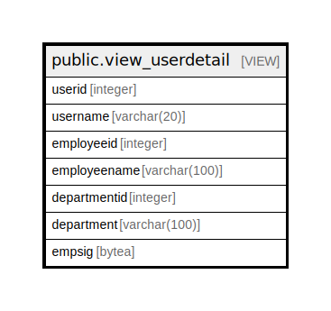

# public.view_userdetail

## Description

<details>
<summary><strong>Table Definition</strong></summary>

```sql
CREATE VIEW view_userdetail AS (
 SELECT sec_usermaster.id AS userid,
    sec_usermaster.username,
    sec_usermaster.employeeid,
    hr_employeemaster.employeename,
    hr_employeemaster.departmentid,
    hr_departmentmaster.department,
    hr_employeemaster.empsig
   FROM ((sec_usermaster
     LEFT JOIN hr_employeemaster ON ((sec_usermaster.employeeid = hr_employeemaster.employeeid)))
     LEFT JOIN hr_departmentmaster ON ((hr_employeemaster.departmentid = hr_departmentmaster.departmentid)))
)
```

</details>

## Columns

| Name | Type | Default | Nullable | Children | Parents | Comment |
| ---- | ---- | ------- | -------- | -------- | ------- | ------- |
| userid | integer |  | true |  |  |  |
| username | varchar(20) |  | true |  |  |  |
| employeeid | integer |  | true |  |  |  |
| employeename | varchar(100) |  | true |  |  |  |
| departmentid | integer |  | true |  |  |  |
| department | varchar(100) |  | true |  |  |  |
| empsig | bytea |  | true |  |  |  |

## Referenced Tables

| Name | Columns | Comment | Type |
| ---- | ------- | ------- | ---- |
| [public.sec_usermaster](public.sec_usermaster.md) | 61 |  | BASE TABLE |
| [public.hr_employeemaster](public.hr_employeemaster.md) | 137 |  | BASE TABLE |
| [public.hr_departmentmaster](public.hr_departmentmaster.md) | 17 |  | BASE TABLE |

## Relations



---

> Generated by [tbls](https://github.com/k1LoW/tbls)
