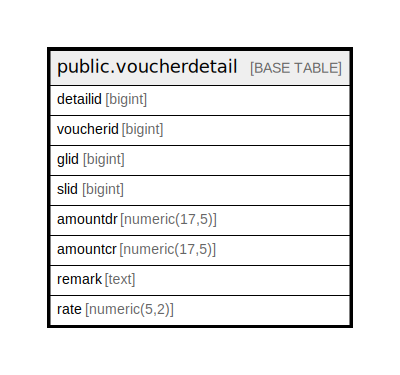

# public.voucherdetail

## Description

## Columns

| Name | Type | Default | Nullable | Children | Parents | Comment |
| ---- | ---- | ------- | -------- | -------- | ------- | ------- |
| detailid | bigint | nextval('voucherdetail_detailid_seq'::regclass) | false |  |  |  |
| voucherid | bigint |  | true |  |  |  |
| glid | bigint |  | true |  |  |  |
| slid | bigint |  | true |  |  |  |
| amountdr | numeric(17,5) | 0 | false |  |  |  |
| amountcr | numeric(17,5) | 0 | false |  |  |  |
| remark | text |  | true |  |  |  |
| rate | numeric(5,2) |  | true |  |  |  |

## Constraints

| Name | Type | Definition |
| ---- | ---- | ---------- |
| voucherdetail_pkey | PRIMARY KEY | PRIMARY KEY (detailid) |

## Indexes

| Name | Definition |
| ---- | ---------- |
| voucherdetail_pkey | CREATE UNIQUE INDEX voucherdetail_pkey ON public.voucherdetail USING btree (detailid) |

## Relations

---

> Generated by [tbls](https://github.com/k1LoW/tbls)
