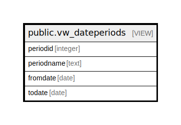

# public.vw_dateperiods

## Description

<details>
<summary><strong>Table Definition</strong></summary>

```sql
CREATE VIEW vw_dateperiods AS (
 SELECT 1 AS periodid,
    'Today'::text AS periodname,
    ('now'::text)::date AS fromdate,
    ('now'::text)::date AS todate
UNION ALL
 SELECT 2 AS periodid,
    'Yesterday'::text AS periodname,
    (('now'::text)::date - 1) AS fromdate,
    (('now'::text)::date - 1) AS todate
UNION ALL
 SELECT 3 AS periodid,
    'Last Week'::text AS periodname,
    ((date_trunc('Days'::text, (('now'::text)::date)::timestamp with time zone) - '7 days'::interval))::date AS fromdate,
    (date_trunc('Days'::text, (('now'::text)::date)::timestamp with time zone))::date AS todate
UNION ALL
 SELECT 4 AS periodid,
    'Current Month'::text AS periodname,
    (date_trunc('MONTH'::text, (('now'::text)::date)::timestamp with time zone))::date AS fromdate,
    (((date_trunc('month'::text, (('now'::text)::date)::timestamp with time zone) + '1 mon'::interval))::date - 1) AS todate
UNION ALL
 SELECT 5 AS periodid,
    'Last Month'::text AS periodname,
    ((date_trunc('month'::text, (('now'::text)::date)::timestamp with time zone) - '1 mon'::interval))::date AS fromdate,
    ((date_trunc('MONTH'::text, (('now'::text)::date)::timestamp with time zone))::date - 1) AS todate
UNION ALL
 SELECT 6 AS periodid,
    'Current Calendar Year'::text AS periodname,
    (date_trunc('Year'::text, (('now'::text)::date)::timestamp with time zone))::date AS fromdate,
    (((date_trunc('Year'::text, (('now'::text)::date)::timestamp with time zone) + '1 year'::interval))::date - 1) AS todate
UNION ALL
 SELECT 7 AS periodid,
    'Last Calendar Year'::text AS periodname,
    ((date_trunc('Year'::text, (('now'::text)::date)::timestamp with time zone) - '1 year'::interval))::date AS fromdate,
    ((date_trunc('Year'::text, (('now'::text)::date)::timestamp with time zone))::date - 1) AS todate
UNION ALL
 SELECT 8 AS periodid,
    'Current Financial Year'::text AS periodname,
        CASE
            WHEN ((to_char(now(), 'dd-Mon-yyyy'::text))::date <= (to_char(now(), '31-Mar-yyyy'::text))::date) THEN (((to_char(now(), '01-Apr-yyyy'::text))::date - '1 year'::interval))::date
            ELSE (to_char(now(), '01-Apr-yyyy'::text))::date
        END AS fromdate,
        CASE
            WHEN ((to_char(now(), 'dd-Mon-yyyy'::text))::date < (to_char(now(), '01-Apr-yyyy'::text))::date) THEN (to_char(now(), '31-Mar-yyyy'::text))::date
            ELSE (((to_char(now(), '31-Mar-yyyy'::text))::date + '1 year'::interval))::date
        END AS todate
UNION ALL
 SELECT 9 AS periodid,
    'Last Financial Year'::text AS periodname,
        CASE
            WHEN ((to_char(now(), 'dd-Mon-yyyy'::text))::date <= (to_char(now(), '31-Mar-yyyy'::text))::date) THEN (((to_char(now(), '01-Apr-yyyy'::text))::date - '2 years'::interval))::date
            ELSE (((to_char(now(), '01-Apr-yyyy'::text))::date - '1 year'::interval))::date
        END AS fromdate,
        CASE
            WHEN ((to_char(now(), 'dd-Mon-yyyy'::text))::date < (to_char(now(), '01-Apr-yyyy'::text))::date) THEN (((to_char(now(), '31-Mar-yyyy'::text))::date - '1 year'::interval))::date
            ELSE (to_char(now(), '31-Mar-yyyy'::text))::date
        END AS todate
UNION ALL
 SELECT 10 AS periodid,
    'Custom'::text AS periodname,
    ('now'::text)::date AS fromdate,
    ('now'::text)::date AS todate
  ORDER BY 1
)
```

</details>

## Columns

| Name | Type | Default | Nullable | Children | Parents | Comment |
| ---- | ---- | ------- | -------- | -------- | ------- | ------- |
| periodid | integer |  | true |  |  |  |
| periodname | text |  | true |  |  |  |
| fromdate | date |  | true |  |  |  |
| todate | date |  | true |  |  |  |

## Relations



---

> Generated by [tbls](https://github.com/k1LoW/tbls)
