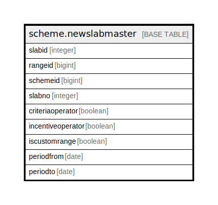

# scheme.newslabmaster

## Description

## Columns

| Name | Type | Default | Nullable | Children | Parents | Comment |
| ---- | ---- | ------- | -------- | -------- | ------- | ------- |
| slabid | integer | nextval('scheme.newslabmaster_slabid_seq'::regclass) | false |  |  |  |
| rangeid | bigint |  | true |  |  |  |
| schemeid | bigint |  | true |  |  |  |
| slabno | integer |  | true |  |  |  |
| criteriaoperator | boolean | false | true |  |  |  |
| incentiveoperator | boolean | false | true |  |  |  |
| iscustomrange | boolean |  | true |  |  |  |
| periodfrom | date |  | true |  |  |  |
| periodto | date |  | true |  |  |  |

## Constraints

| Name | Type | Definition |
| ---- | ---- | ---------- |
| newslabmaster_pkey | PRIMARY KEY | PRIMARY KEY (slabid) |

## Indexes

| Name | Definition |
| ---- | ---------- |
| newslabmaster_pkey | CREATE UNIQUE INDEX newslabmaster_pkey ON scheme.newslabmaster USING btree (slabid) |

## Relations

---

> Generated by [tbls](https://github.com/k1LoW/tbls)
