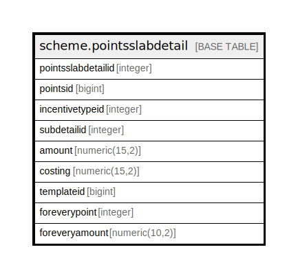

# scheme.pointsslabdetail

## Description

## Columns

| Name | Type | Default | Nullable | Children | Parents | Comment |
| ---- | ---- | ------- | -------- | -------- | ------- | ------- |
| pointsslabdetailid | integer | nextval('scheme.pointsslabdetail_pointsslabdetailid_seq'::regclass) | false |  |  |  |
| pointsid | bigint |  | true |  |  |  |
| incentivetypeid | integer |  | true |  |  |  |
| subdetailid | integer |  | true |  |  |  |
| amount | numeric(15,2) |  | true |  |  |  |
| costing | numeric(15,2) |  | true |  |  |  |
| templateid | bigint |  | true |  |  |  |
| foreverypoint | integer |  | true |  |  |  |
| foreveryamount | numeric(10,2) |  | true |  |  |  |

## Constraints

| Name | Type | Definition |
| ---- | ---- | ---------- |
| pointsslabdetail_pkey | PRIMARY KEY | PRIMARY KEY (pointsslabdetailid) |

## Indexes

| Name | Definition |
| ---- | ---------- |
| pointsslabdetail_pkey | CREATE UNIQUE INDEX pointsslabdetail_pkey ON scheme.pointsslabdetail USING btree (pointsslabdetailid) |

## Relations

---

> Generated by [tbls](https://github.com/k1LoW/tbls)
