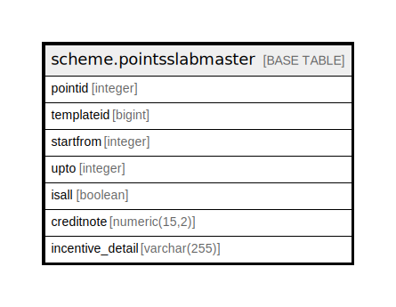

# scheme.pointsslabmaster

## Description

## Columns

| Name | Type | Default | Nullable | Children | Parents | Comment |
| ---- | ---- | ------- | -------- | -------- | ------- | ------- |
| pointid | integer | nextval('scheme.pointsslabmaster_pointid_seq'::regclass) | false |  |  |  |
| templateid | bigint |  | true |  |  |  |
| startfrom | integer |  | false |  |  |  |
| upto | integer | 0 | false |  |  |  |
| isall | boolean | false | false |  |  |  |
| creditnote | numeric(15,2) | 0 | true |  |  |  |
| incentive_detail | varchar(255) |  | true |  |  |  |

## Constraints

| Name | Type | Definition |
| ---- | ---- | ---------- |
| pointsslabmaster_pkey | PRIMARY KEY | PRIMARY KEY (pointid) |

## Indexes

| Name | Definition |
| ---- | ---------- |
| pointsslabmaster_pkey | CREATE UNIQUE INDEX pointsslabmaster_pkey ON scheme.pointsslabmaster USING btree (pointid) |

## Relations

---

> Generated by [tbls](https://github.com/k1LoW/tbls)
