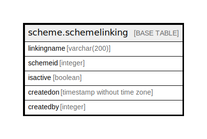

# scheme.schemelinking

## Description

## Columns

| Name | Type | Default | Nullable | Children | Parents | Comment |
| ---- | ---- | ------- | -------- | -------- | ------- | ------- |
| linkingname | varchar(200) |  | true |  |  |  |
| schemeid | integer |  | true |  |  |  |
| isactive | boolean | true | true |  |  |  |
| createdon | timestamp without time zone |  | true |  |  |  |
| createdby | integer |  | true |  |  |  |

## Relations

---

> Generated by [tbls](https://github.com/k1LoW/tbls)
