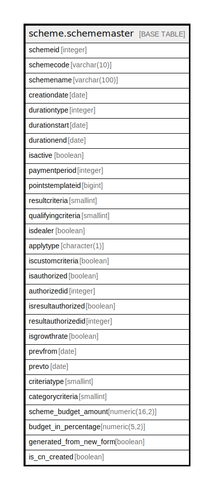

# scheme.schememaster

## Description

## Columns

| Name | Type | Default | Nullable | Children | Parents | Comment |
| ---- | ---- | ------- | -------- | -------- | ------- | ------- |
| schemeid | integer | nextval('scheme.schememaster_schemeid_seq'::regclass) | false |  |  |  |
| schemecode | varchar(10) |  | true |  |  |  |
| schemename | varchar(100) |  | true |  |  |  |
| creationdate | date |  | true |  |  |  |
| durationtype | integer |  | true |  |  |  |
| durationstart | date |  | true |  |  |  |
| durationend | date |  | true |  |  |  |
| isactive | boolean | true | true |  |  |  |
| paymentperiod | integer | 0 | true |  |  |  |
| pointstemplateid | bigint |  | true |  |  |  |
| resultcriteria | smallint | 0 | true |  |  |  |
| qualifyingcriteria | smallint |  | true |  |  |  |
| isdealer | boolean |  | true |  |  |  |
| applytype | character(1) |  | true |  |  |  |
| iscustomcriteria | boolean | false | true |  |  |  |
| isauthorized | boolean | false | true |  |  |  |
| authorizedid | integer |  | true |  |  |  |
| isresultauthorized | boolean | false | true |  |  |  |
| resultauthorizedid | integer |  | true |  |  |  |
| isgrowthrate | boolean | false | true |  |  |  |
| prevfrom | date |  | true |  |  |  |
| prevto | date |  | true |  |  |  |
| criteriatype | smallint | 0 | true |  |  |  |
| categorycriteria | smallint | 0 | true |  |  |  |
| scheme_budget_amount | numeric(16,2) |  | true |  |  |  |
| budget_in_percentage | numeric(5,2) |  | true |  |  |  |
| generated_from_new_form | boolean | false | true |  |  |  |
| is_cn_created | boolean | false | true |  |  |  |

## Constraints

| Name | Type | Definition |
| ---- | ---- | ---------- |
| scheme_unique | UNIQUE | UNIQUE (schemename) |
| schememaster_pkey | PRIMARY KEY | PRIMARY KEY (schemeid) |

## Indexes

| Name | Definition |
| ---- | ---------- |
| scheme_unique | CREATE UNIQUE INDEX scheme_unique ON scheme.schememaster USING btree (schemename) |
| schememaster_pkey | CREATE UNIQUE INDEX schememaster_pkey ON scheme.schememaster USING btree (schemeid) |

## Relations

---

> Generated by [tbls](https://github.com/k1LoW/tbls)
