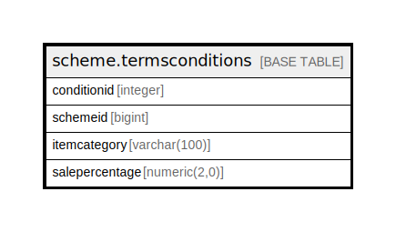

# scheme.termsconditions

## Description

## Columns

| Name | Type | Default | Nullable | Children | Parents | Comment |
| ---- | ---- | ------- | -------- | -------- | ------- | ------- |
| conditionid | integer | nextval('scheme.termsconditions_conditionid_seq'::regclass) | false |  |  |  |
| schemeid | bigint |  | true |  |  |  |
| itemcategory | varchar(100) |  | true |  |  |  |
| salepercentage | numeric(2,0) | 0 | true |  |  |  |

## Constraints

| Name | Type | Definition |
| ---- | ---- | ---------- |
| termsconditions_pkey | PRIMARY KEY | PRIMARY KEY (conditionid) |

## Indexes

| Name | Definition |
| ---- | ---------- |
| termsconditions_pkey | CREATE UNIQUE INDEX termsconditions_pkey ON scheme.termsconditions USING btree (conditionid) |

## Relations

---

> Generated by [tbls](https://github.com/k1LoW/tbls)
