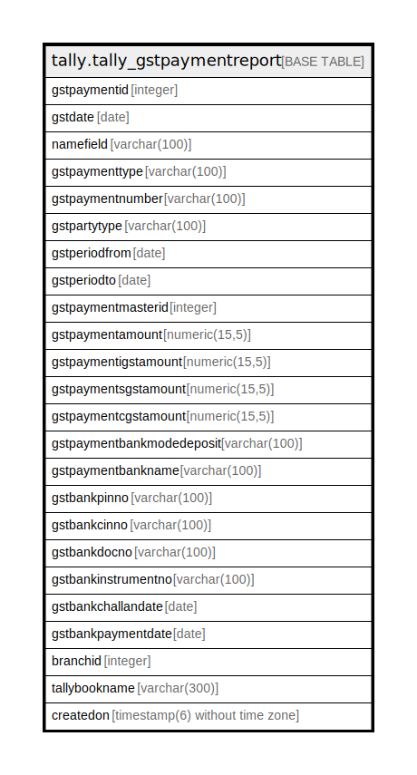

# tally.tally_gstpaymentreport

## Description

## Columns

| Name | Type | Default | Nullable | Children | Parents | Comment |
| ---- | ---- | ------- | -------- | -------- | ------- | ------- |
| gstpaymentid | integer | nextval('tally.tally_gstpaymentreport_gstpaymentid_seq'::regclass) | false |  |  |  |
| gstdate | date |  | true |  |  |  |
| namefield | varchar(100) |  | true |  |  |  |
| gstpaymenttype | varchar(100) |  | true |  |  |  |
| gstpaymentnumber | varchar(100) |  | true |  |  |  |
| gstpartytype | varchar(100) |  | true |  |  |  |
| gstperiodfrom | date |  | true |  |  |  |
| gstperiodto | date |  | true |  |  |  |
| gstpaymentmasterid | integer |  | true |  |  |  |
| gstpaymentamount | numeric(15,5) |  | true |  |  |  |
| gstpaymentigstamount | numeric(15,5) |  | true |  |  |  |
| gstpaymentsgstamount | numeric(15,5) |  | true |  |  |  |
| gstpaymentcgstamount | numeric(15,5) |  | true |  |  |  |
| gstpaymentbankmodedeposit | varchar(100) |  | true |  |  |  |
| gstpaymentbankname | varchar(100) |  | true |  |  |  |
| gstbankpinno | varchar(100) |  | true |  |  |  |
| gstbankcinno | varchar(100) |  | true |  |  |  |
| gstbankdocno | varchar(100) |  | true |  |  |  |
| gstbankinstrumentno | varchar(100) |  | true |  |  |  |
| gstbankchallandate | date |  | true |  |  |  |
| gstbankpaymentdate | date |  | true |  |  |  |
| branchid | integer |  | true |  |  |  |
| tallybookname | varchar(300) |  | true |  |  |  |
| createdon | timestamp(6) without time zone | now() | true |  |  |  |

## Constraints

| Name | Type | Definition |
| ---- | ---- | ---------- |
| tally_gstpaymentreport_pkey | PRIMARY KEY | PRIMARY KEY (gstpaymentid) |

## Indexes

| Name | Definition |
| ---- | ---------- |
| tally_gstpaymentreport_pkey | CREATE UNIQUE INDEX tally_gstpaymentreport_pkey ON tally.tally_gstpaymentreport USING btree (gstpaymentid) |

## Relations

---

> Generated by [tbls](https://github.com/k1LoW/tbls)
