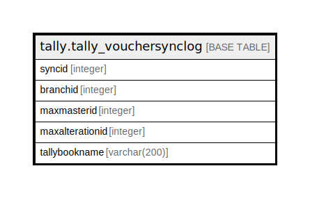

# tally.tally_vouchersynclog

## Description

## Columns

| Name | Type | Default | Nullable | Children | Parents | Comment |
| ---- | ---- | ------- | -------- | -------- | ------- | ------- |
| syncid | integer | nextval('tally.tally_vouchersynclog_syncid_seq'::regclass) | false |  |  |  |
| branchid | integer |  | true |  |  |  |
| maxmasterid | integer |  | true |  |  |  |
| maxalterationid | integer |  | true |  |  |  |
| tallybookname | varchar(200) |  | true |  |  |  |

## Constraints

| Name | Type | Definition |
| ---- | ---- | ---------- |
| tally_vouchersynclog_pkey | PRIMARY KEY | PRIMARY KEY (syncid) |

## Indexes

| Name | Definition |
| ---- | ---------- |
| tally_vouchersynclog_pkey | CREATE UNIQUE INDEX tally_vouchersynclog_pkey ON tally.tally_vouchersynclog USING btree (syncid) |

## Relations

---

> Generated by [tbls](https://github.com/k1LoW/tbls)
