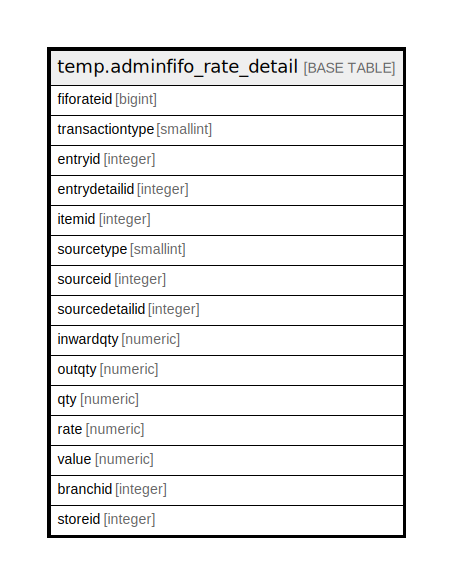

# temp.adminfifo_rate_detail

## Description

## Columns

| Name | Type | Default | Nullable | Children | Parents | Comment |
| ---- | ---- | ------- | -------- | -------- | ------- | ------- |
| fiforateid | bigint | nextval('temp.adminfifo_rate_detail_seq'::regclass) | false |  |  |  |
| transactiontype | smallint |  | true |  |  |  |
| entryid | integer |  | true |  |  |  |
| entrydetailid | integer |  | true |  |  |  |
| itemid | integer |  | true |  |  |  |
| sourcetype | smallint |  | true |  |  |  |
| sourceid | integer |  | true |  |  |  |
| sourcedetailid | integer |  | true |  |  |  |
| inwardqty | numeric |  | true |  |  |  |
| outqty | numeric |  | true |  |  |  |
| qty | numeric |  | true |  |  |  |
| rate | numeric |  | true |  |  |  |
| value | numeric |  | true |  |  |  |
| branchid | integer |  | true |  |  |  |
| storeid | integer |  | true |  |  |  |

## Relations

---

> Generated by [tbls](https://github.com/k1LoW/tbls)
