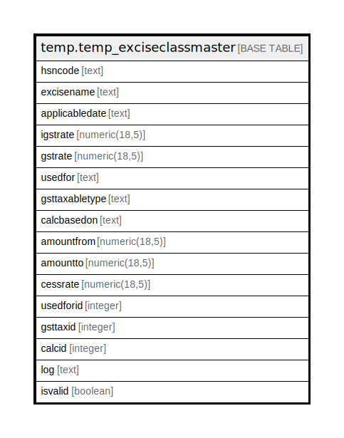

# temp.temp_exciseclassmaster

## Description

## Columns

| Name | Type | Default | Nullable | Children | Parents | Comment |
| ---- | ---- | ------- | -------- | -------- | ------- | ------- |
| hsncode | text |  | true |  |  |  |
| excisename | text |  | true |  |  |  |
| applicabledate | text |  | true |  |  |  |
| igstrate | numeric(18,5) |  | true |  |  |  |
| gstrate | numeric(18,5) |  | true |  |  |  |
| usedfor | text |  | true |  |  |  |
| gsttaxabletype | text |  | true |  |  |  |
| calcbasedon | text |  | true |  |  |  |
| amountfrom | numeric(18,5) |  | true |  |  |  |
| amountto | numeric(18,5) |  | true |  |  |  |
| cessrate | numeric(18,5) |  | true |  |  |  |
| usedforid | integer |  | true |  |  |  |
| gsttaxid | integer |  | true |  |  |  |
| calcid | integer |  | true |  |  |  |
| log | text |  | true |  |  |  |
| isvalid | boolean |  | true |  |  |  |

## Relations

---

> Generated by [tbls](https://github.com/k1LoW/tbls)
