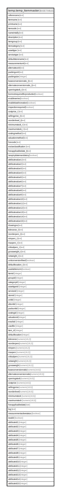

# temp.temp_itemmaster

## Description

## Columns

| Name | Type | Default | Nullable | Children | Parents | Comment |
| ---- | ---- | ------- | -------- | -------- | ------- | ------- |
| referenceno | text |  | true |  |  |  |
| itemname | text |  | true |  |  |  |
| printname | text |  | true |  |  |  |
| itemcode | text |  | true |  |  |  |
| nameintally | text |  | true |  |  |  |
| description | text |  | true |  |  |  |
| itemgroup | text |  | true |  |  |  |
| itemcategory | text |  | true |  |  |  |
| assettype | text |  | true |  |  |  |
| servicetype | text |  | true |  |  |  |
| defaultstorename | text |  | true |  |  |  |
| measurementunit | text |  | true |  |  |  |
| alternateunit | text |  | true |  |  |  |
| packingunit | text |  | true |  |  |  |
| packingsize | integer |  | true |  |  |  |
| baseconversionratio_t | text |  | true |  |  |  |
| alternateconversionratio_t | text |  | true |  |  |  |
| openingstock_t | text |  | true |  |  |  |
| bomnotrequiredforproduction | boolean |  | true |  |  |  |
| enableseries | boolean |  | true |  |  |  |
| enablebatchcreation | boolean |  | true |  |  |  |
| inspectionrequired | boolean |  | true |  |  |  |
| costprice_t | text |  | true |  |  |  |
| sellingprice_t | text |  | true |  |  |  |
| reorderlevel_t | text |  | true |  |  |  |
| minimumstock_t | text |  | true |  |  |  |
| maximumstock_t | text |  | true |  |  |  |
| costingmethod | text |  | true |  |  |  |
| valuationmethod | text |  | true |  |  |  |
| hsncode | text |  | true |  |  |  |
| exciseclassification | text |  | true |  |  |  |
| hsnapplicabledate_t | text |  | true |  |  |  |
| isexpirydatemandatory | boolean |  | true |  |  |  |
| attributevalue1 | text |  | true |  |  |  |
| attributevalue2 | text |  | true |  |  |  |
| attributevalue3 | text |  | true |  |  |  |
| attributevalue4 | text |  | true |  |  |  |
| attributevalue5 | text |  | true |  |  |  |
| attributevalue6 | text |  | true |  |  |  |
| attributevalue7 | text |  | true |  |  |  |
| attributevalue8 | text |  | true |  |  |  |
| attributevalue9 | text |  | true |  |  |  |
| attributevalue10 | text |  | true |  |  |  |
| attributevalue11 | text |  | true |  |  |  |
| attributevalue12 | text |  | true |  |  |  |
| attributevalue13 | text |  | true |  |  |  |
| attributevalue14 | text |  | true |  |  |  |
| attributevalue15 | text |  | true |  |  |  |
| drawingno | text |  | true |  |  |  |
| tolerance_t | text |  | true |  |  |  |
| reorderperc_t | text |  | true |  |  |  |
| minperc_t | text |  | true |  |  |  |
| maxperc_t | text |  | true |  |  |  |
| criticalperc_t | text |  | true |  |  |  |
| grossweight_t | text |  | true |  |  |  |
| netweight_t | text |  | true |  |  |  |
| unitconversionfixed | boolean |  | true |  |  |  |
| defaultlocation_t | text |  | true |  |  |  |
| availableincrm | boolean |  | true |  |  |  |
| itemid | integer |  | true |  |  |  |
| groupid | integer |  | true |  |  |  |
| categoryid | integer |  | true |  |  |  |
| assettypeid | integer |  | true |  |  |  |
| serviceid | integer |  | true |  |  |  |
| storeid | integer |  | true |  |  |  |
| unitid | integer |  | true |  |  |  |
| altunitid | integer |  | true |  |  |  |
| packunitid | integer |  | true |  |  |  |
| costingid | integer |  | true |  |  |  |
| valuationid | integer |  | true |  |  |  |
| exsclsid | integer |  | true |  |  |  |
| usedfor | integer |  | true |  |  |  |
| item_id | integer |  | true |  |  |  |
| defaultlocation | integer |  | true |  |  |  |
| tolerance | numeric(18,2) |  | true |  |  |  |
| reorderperc | numeric(18,2) |  | true |  |  |  |
| minperc | numeric(18,2) |  | true |  |  |  |
| maxperc | numeric(18,2) |  | true |  |  |  |
| criticalperc | numeric(18,2) |  | true |  |  |  |
| netweight | numeric(18,2) |  | true |  |  |  |
| grossweight | numeric(18,2) |  | true |  |  |  |
| baseconversionratio | numeric(18,5) |  | true |  |  |  |
| alternateconversionratio | numeric(18,5) |  | true |  |  |  |
| openingstock | numeric(18,5) |  | true |  |  |  |
| costprice | numeric(18,5) |  | true |  |  |  |
| sellingprice | numeric(18,5) |  | true |  |  |  |
| reorderlevel | numeric(18,5) |  | true |  |  |  |
| minimumstock | numeric(18,5) |  | true |  |  |  |
| maximumstock | numeric(18,5) |  | true |  |  |  |
| hsnapplicabledate | date |  | true |  |  |  |
| log | text |  | true |  |  |  |
| measurementactivestatus | boolean |  | true |  |  |  |
| isvalid | boolean |  | true |  |  |  |
| attributeid1 | integer |  | true |  |  |  |
| attributeid2 | integer |  | true |  |  |  |
| attributeid3 | integer |  | true |  |  |  |
| attributeid4 | integer |  | true |  |  |  |
| attributeid5 | integer |  | true |  |  |  |
| attributeid6 | integer |  | true |  |  |  |
| attributeid7 | integer |  | true |  |  |  |
| attributeid8 | integer |  | true |  |  |  |
| attributeid9 | integer |  | true |  |  |  |
| attributeid10 | integer |  | true |  |  |  |
| attributeid11 | integer |  | true |  |  |  |
| attributeid12 | integer |  | true |  |  |  |
| attributeid13 | integer |  | true |  |  |  |
| attributeid14 | integer |  | true |  |  |  |
| attributeid15 | integer |  | true |  |  |  |

## Relations

---

> Generated by [tbls](https://github.com/k1LoW/tbls)
