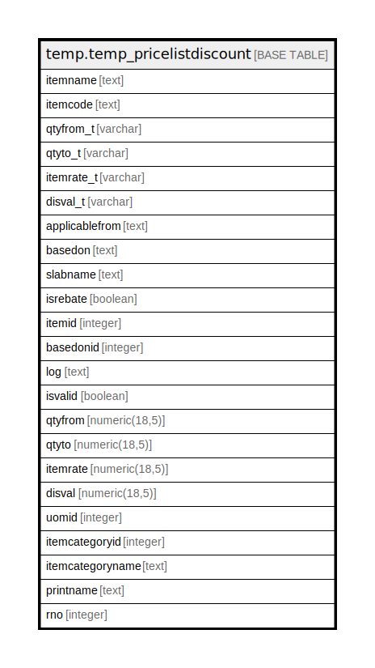

# temp.temp_pricelistdiscount

## Description

## Columns

| Name | Type | Default | Nullable | Children | Parents | Comment |
| ---- | ---- | ------- | -------- | -------- | ------- | ------- |
| itemname | text |  | true |  |  |  |
| itemcode | text |  | true |  |  |  |
| qtyfrom_t | varchar |  | true |  |  |  |
| qtyto_t | varchar |  | true |  |  |  |
| itemrate_t | varchar |  | true |  |  |  |
| disval_t | varchar |  | true |  |  |  |
| applicablefrom | text |  | true |  |  |  |
| basedon | text |  | true |  |  |  |
| slabname | text |  | true |  |  |  |
| isrebate | boolean |  | true |  |  |  |
| itemid | integer |  | true |  |  |  |
| basedonid | integer |  | true |  |  |  |
| log | text |  | true |  |  |  |
| isvalid | boolean |  | true |  |  |  |
| qtyfrom | numeric(18,5) |  | true |  |  |  |
| qtyto | numeric(18,5) |  | true |  |  |  |
| itemrate | numeric(18,5) |  | true |  |  |  |
| disval | numeric(18,5) |  | true |  |  |  |
| uomid | integer |  | true |  |  |  |
| itemcategoryid | integer |  | true |  |  |  |
| itemcategoryname | text |  | true |  |  |  |
| printname | text |  | true |  |  |  |
| rno | integer |  | true |  |  |  |

## Relations

---

> Generated by [tbls](https://github.com/k1LoW/tbls)
