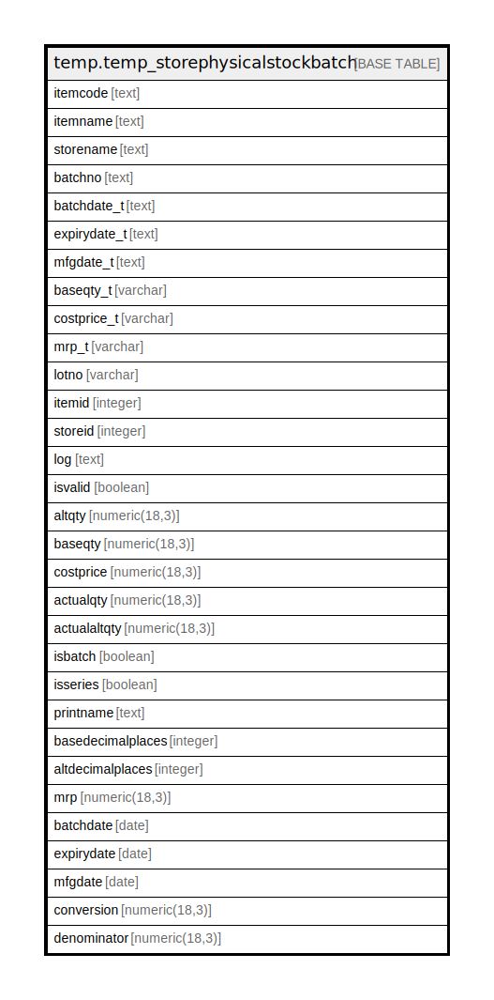

# temp.temp_storephysicalstockbatch

## Description

## Columns

| Name | Type | Default | Nullable | Children | Parents | Comment |
| ---- | ---- | ------- | -------- | -------- | ------- | ------- |
| itemcode | text |  | true |  |  |  |
| itemname | text |  | true |  |  |  |
| storename | text |  | true |  |  |  |
| batchno | text |  | true |  |  |  |
| batchdate_t | text |  | true |  |  |  |
| expirydate_t | text |  | true |  |  |  |
| mfgdate_t | text |  | true |  |  |  |
| baseqty_t | varchar |  | true |  |  |  |
| costprice_t | varchar |  | true |  |  |  |
| mrp_t | varchar |  | true |  |  |  |
| lotno | varchar |  | true |  |  |  |
| itemid | integer |  | true |  |  |  |
| storeid | integer |  | true |  |  |  |
| log | text |  | true |  |  |  |
| isvalid | boolean |  | true |  |  |  |
| altqty | numeric(18,3) |  | true |  |  |  |
| baseqty | numeric(18,3) |  | true |  |  |  |
| costprice | numeric(18,3) |  | true |  |  |  |
| actualqty | numeric(18,3) |  | true |  |  |  |
| actualaltqty | numeric(18,3) |  | true |  |  |  |
| isbatch | boolean |  | true |  |  |  |
| isseries | boolean |  | true |  |  |  |
| printname | text |  | true |  |  |  |
| basedecimalplaces | integer |  | true |  |  |  |
| altdecimalplaces | integer |  | true |  |  |  |
| mrp | numeric(18,3) |  | true |  |  |  |
| batchdate | date |  | true |  |  |  |
| expirydate | date |  | true |  |  |  |
| mfgdate | date |  | true |  |  |  |
| conversion | numeric(18,3) |  | true |  |  |  |
| denominator | numeric(18,3) |  | true |  |  |  |

## Relations

---

> Generated by [tbls](https://github.com/k1LoW/tbls)
