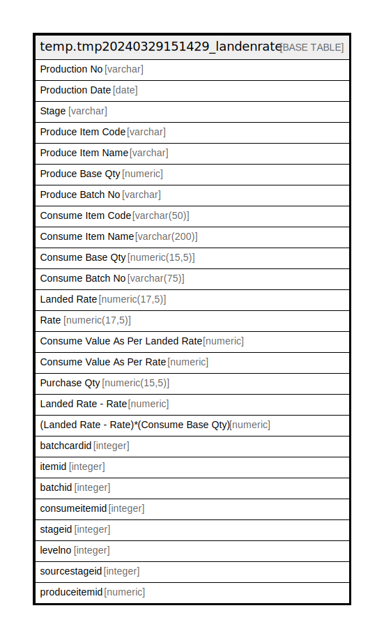

# temp.tmp20240329151429_landenrate

## Description

## Columns

| Name | Type | Default | Nullable | Children | Parents | Comment |
| ---- | ---- | ------- | -------- | -------- | ------- | ------- |
| Production No | varchar |  | true |  |  |  |
| Production Date | date |  | true |  |  |  |
| Stage | varchar |  | true |  |  |  |
| Produce Item Code | varchar |  | true |  |  |  |
| Produce Item Name | varchar |  | true |  |  |  |
| Produce Base Qty | numeric |  | true |  |  |  |
| Produce Batch No | varchar |  | true |  |  |  |
| Consume Item Code | varchar(50) |  | true |  |  |  |
| Consume Item Name | varchar(200) |  | true |  |  |  |
| Consume Base Qty | numeric(15,5) |  | true |  |  |  |
| Consume Batch No | varchar(75) |  | true |  |  |  |
| Landed Rate | numeric(17,5) |  | true |  |  |  |
| Rate | numeric(17,5) |  | true |  |  |  |
| Consume Value As Per Landed Rate | numeric |  | true |  |  |  |
| Consume Value As Per Rate | numeric |  | true |  |  |  |
| Purchase Qty | numeric(15,5) |  | true |  |  |  |
| Landed Rate - Rate | numeric |  | true |  |  |  |
| (Landed Rate - Rate)*(Consume Base Qty) | numeric |  | true |  |  |  |
| batchcardid | integer |  | true |  |  |  |
| itemid | integer |  | true |  |  |  |
| batchid | integer |  | true |  |  |  |
| consumeitemid | integer |  | true |  |  |  |
| stageid | integer |  | true |  |  |  |
| levelno | integer |  | true |  |  |  |
| sourcestageid | integer |  | true |  |  |  |
| produceitemid | numeric |  | true |  |  |  |

## Relations

---

> Generated by [tbls](https://github.com/k1LoW/tbls)
