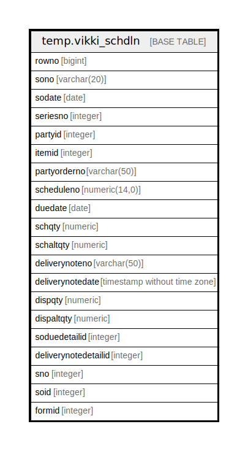

# temp.vikki_schdln

## Description

## Columns

| Name | Type | Default | Nullable | Children | Parents | Comment |
| ---- | ---- | ------- | -------- | -------- | ------- | ------- |
| rowno | bigint |  | true |  |  |  |
| sono | varchar(20) |  | true |  |  |  |
| sodate | date |  | true |  |  |  |
| seriesno | integer |  | true |  |  |  |
| partyid | integer |  | true |  |  |  |
| itemid | integer |  | true |  |  |  |
| partyorderno | varchar(50) |  | true |  |  |  |
| scheduleno | numeric(14,0) |  | true |  |  |  |
| duedate | date |  | true |  |  |  |
| schqty | numeric |  | true |  |  |  |
| schaltqty | numeric |  | true |  |  |  |
| deliverynoteno | varchar(50) |  | true |  |  |  |
| deliverynotedate | timestamp without time zone |  | true |  |  |  |
| dispqty | numeric |  | true |  |  |  |
| dispaltqty | numeric |  | true |  |  |  |
| soduedetailid | integer |  | true |  |  |  |
| deliverynotedetailid | integer |  | true |  |  |  |
| sno | integer |  | true |  |  |  |
| soid | integer |  | true |  |  |  |
| formid | integer |  | true |  |  |  |

## Relations

---

> Generated by [tbls](https://github.com/k1LoW/tbls)
