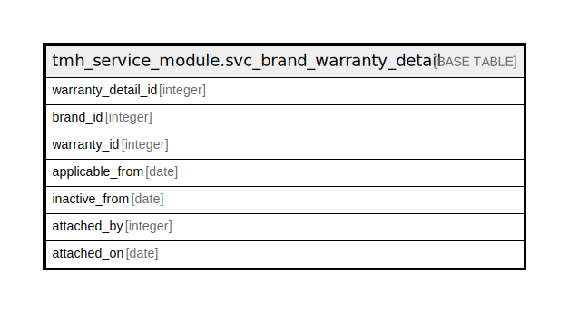

# tmh_service_module.svc_brand_warranty_detail

## Description

## Columns

| Name | Type | Default | Nullable | Children | Parents | Comment |
| ---- | ---- | ------- | -------- | -------- | ------- | ------- |
| warranty_detail_id | integer | nextval('tmh_service_module.svc_brand_warranty_detail_warranty_detail_id_seq'::regclass) | false |  |  |  |
| brand_id | integer |  | true |  |  |  |
| warranty_id | integer |  | true |  |  |  |
| applicable_from | date |  | true |  |  |  |
| inactive_from | date |  | true |  |  |  |
| attached_by | integer |  | true |  |  |  |
| attached_on | date |  | true |  |  |  |

## Constraints

| Name | Type | Definition |
| ---- | ---- | ---------- |
| svc_brand_warranty_detail_pkey | PRIMARY KEY | PRIMARY KEY (warranty_detail_id) |

## Indexes

| Name | Definition |
| ---- | ---------- |
| svc_brand_warranty_detail_pkey | CREATE UNIQUE INDEX svc_brand_warranty_detail_pkey ON tmh_service_module.svc_brand_warranty_detail USING btree (warranty_detail_id) |

## Relations

---

> Generated by [tbls](https://github.com/k1LoW/tbls)
