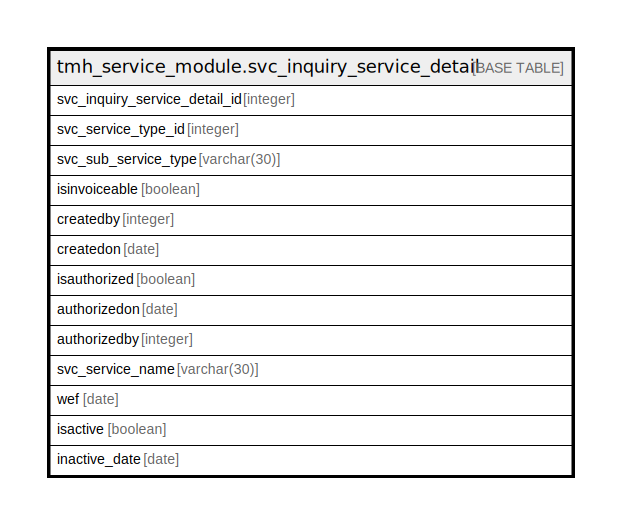

# tmh_service_module.svc_inquiry_service_detail

## Description

## Columns

| Name | Type | Default | Nullable | Children | Parents | Comment |
| ---- | ---- | ------- | -------- | -------- | ------- | ------- |
| svc_inquiry_service_detail_id | integer | nextval('tmh_service_module.svc_inquiry_service_detail_svc_inquiry_service_detail_id_seq'::regclass) | false |  |  |  |
| svc_service_type_id | integer |  | true |  |  |  |
| svc_sub_service_type | varchar(30) | NULL::character varying | true |  |  |  |
| isinvoiceable | boolean | true | true |  |  |  |
| createdby | integer |  | true |  |  |  |
| createdon | date |  | true |  |  |  |
| isauthorized | boolean | false | true |  |  |  |
| authorizedon | date |  | true |  |  |  |
| authorizedby | integer |  | true |  |  |  |
| svc_service_name | varchar(30) | NULL::character varying | true |  |  |  |
| wef | date |  | true |  |  |  |
| isactive | boolean | true | true |  |  |  |
| inactive_date | date |  | true |  |  |  |

## Relations

---

> Generated by [tbls](https://github.com/k1LoW/tbls)
