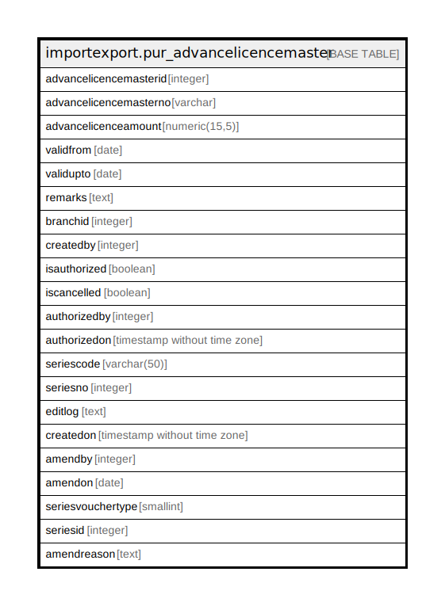

# importexport.pur_advancelicencemaster

## Description

## Columns

| Name | Type | Default | Nullable | Children | Parents | Comment |
| ---- | ---- | ------- | -------- | -------- | ------- | ------- |
| advancelicencemasterid | integer | nextval('importexport.pur_advancelicencemaster_advancelicencemasterid_seq'::regclass) | false |  |  |  |
| advancelicencemasterno | varchar |  | true |  |  |  |
| advancelicenceamount | numeric(15,5) |  | true |  |  |  |
| validfrom | date |  | true |  |  |  |
| validupto | date |  | true |  |  |  |
| remarks | text |  | true |  |  |  |
| branchid | integer |  | true |  |  |  |
| createdby | integer |  | false |  |  |  |
| isauthorized | boolean | false | false |  |  |  |
| iscancelled | boolean | false | false |  |  |  |
| authorizedby | integer |  | true |  |  |  |
| authorizedon | timestamp without time zone |  | true |  |  |  |
| seriescode | varchar(50) |  | true |  |  |  |
| seriesno | integer |  | true |  |  |  |
| editlog | text |  | true |  |  |  |
| createdon | timestamp without time zone | now() | true |  |  |  |
| amendby | integer |  | true |  |  |  |
| amendon | date |  | true |  |  |  |
| seriesvouchertype | smallint | 0 | true |  |  |  |
| seriesid | integer |  | true |  |  |  |
| amendreason | text |  | true |  |  |  |

## Constraints

| Name | Type | Definition |
| ---- | ---- | ---------- |
| pur_advancelicencemaster_pkey | PRIMARY KEY | PRIMARY KEY (advancelicencemasterid) |

## Indexes

| Name | Definition |
| ---- | ---------- |
| pur_advancelicencemaster_pkey | CREATE UNIQUE INDEX pur_advancelicencemaster_pkey ON importexport.pur_advancelicencemaster USING btree (advancelicencemasterid) |

## Relations

---

> Generated by [tbls](https://github.com/k1LoW/tbls)
