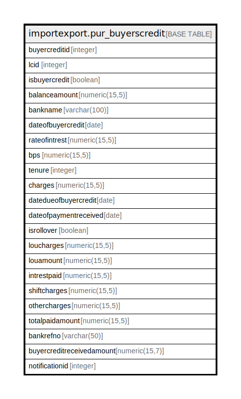

# importexport.pur_buyerscredit

## Description

## Columns

| Name | Type | Default | Nullable | Children | Parents | Comment |
| ---- | ---- | ------- | -------- | -------- | ------- | ------- |
| buyercreditid | integer | nextval('importexport.pur_buyerscredit_buyercreditid_seq'::regclass) | false |  |  |  |
| lcid | integer |  | false |  |  |  |
| isbuyercredit | boolean | false | true |  |  |  |
| balanceamount | numeric(15,5) |  | true |  |  |  |
| bankname | varchar(100) |  | true |  |  |  |
| dateofbuyercredit | date |  | true |  |  |  |
| rateofintrest | numeric(15,5) |  | true |  |  |  |
| bps | numeric(15,5) |  | true |  |  |  |
| tenure | integer |  | true |  |  |  |
| charges | numeric(15,5) |  | true |  |  |  |
| datedueofbuyercredit | date |  | true |  |  |  |
| dateofpaymentreceived | date |  | true |  |  |  |
| isrollover | boolean | false | true |  |  |  |
| loucharges | numeric(15,5) |  | true |  |  |  |
| louamount | numeric(15,5) |  | true |  |  |  |
| intrestpaid | numeric(15,5) |  | true |  |  |  |
| shiftcharges | numeric(15,5) |  | true |  |  |  |
| othercharges | numeric(15,5) |  | true |  |  |  |
| totalpaidamount | numeric(15,5) |  | true |  |  |  |
| bankrefno | varchar(50) |  | true |  |  |  |
| buyercreditreceivedamount | numeric(15,7) |  | true |  |  |  |
| notificationid | integer |  | true |  |  |  |

## Constraints

| Name | Type | Definition |
| ---- | ---- | ---------- |
| pur_buyerscredit_pkey | PRIMARY KEY | PRIMARY KEY (buyercreditid) |

## Indexes

| Name | Definition |
| ---- | ---------- |
| pur_buyerscredit_pkey | CREATE UNIQUE INDEX pur_buyerscredit_pkey ON importexport.pur_buyerscredit USING btree (buyercreditid) |

## Relations

---

> Generated by [tbls](https://github.com/k1LoW/tbls)
