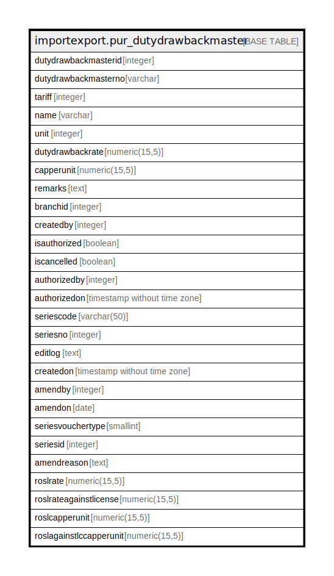

# importexport.pur_dutydrawbackmaster

## Description

## Columns

| Name | Type | Default | Nullable | Children | Parents | Comment |
| ---- | ---- | ------- | -------- | -------- | ------- | ------- |
| dutydrawbackmasterid | integer | nextval('importexport.pur_dutydrawbackmaster_dutydrawbackmasterid_seq'::regclass) | false |  |  |  |
| dutydrawbackmasterno | varchar |  | true |  |  |  |
| tariff | integer |  | true |  |  |  |
| name | varchar |  | true |  |  |  |
| unit | integer |  | true |  |  |  |
| dutydrawbackrate | numeric(15,5) |  | true |  |  |  |
| capperunit | numeric(15,5) |  | true |  |  |  |
| remarks | text |  | true |  |  |  |
| branchid | integer |  | true |  |  |  |
| createdby | integer |  | false |  |  |  |
| isauthorized | boolean | false | false |  |  |  |
| iscancelled | boolean | false | false |  |  |  |
| authorizedby | integer |  | true |  |  |  |
| authorizedon | timestamp without time zone |  | true |  |  |  |
| seriescode | varchar(50) |  | true |  |  |  |
| seriesno | integer |  | true |  |  |  |
| editlog | text |  | true |  |  |  |
| createdon | timestamp without time zone | now() | true |  |  |  |
| amendby | integer |  | true |  |  |  |
| amendon | date |  | true |  |  |  |
| seriesvouchertype | smallint | 0 | true |  |  |  |
| seriesid | integer |  | true |  |  |  |
| amendreason | text |  | true |  |  |  |
| roslrate | numeric(15,5) |  | true |  |  |  |
| roslrateagainstlicense | numeric(15,5) |  | true |  |  |  |
| roslcapperunit | numeric(15,5) |  | true |  |  |  |
| roslagainstlccapperunit | numeric(15,5) |  | true |  |  |  |

## Constraints

| Name | Type | Definition |
| ---- | ---- | ---------- |
| pur_dutydrawbackmaster_pkey | PRIMARY KEY | PRIMARY KEY (dutydrawbackmasterid) |

## Indexes

| Name | Definition |
| ---- | ---------- |
| pur_dutydrawbackmaster_pkey | CREATE UNIQUE INDEX pur_dutydrawbackmaster_pkey ON importexport.pur_dutydrawbackmaster USING btree (dutydrawbackmasterid) |

## Relations

---

> Generated by [tbls](https://github.com/k1LoW/tbls)
