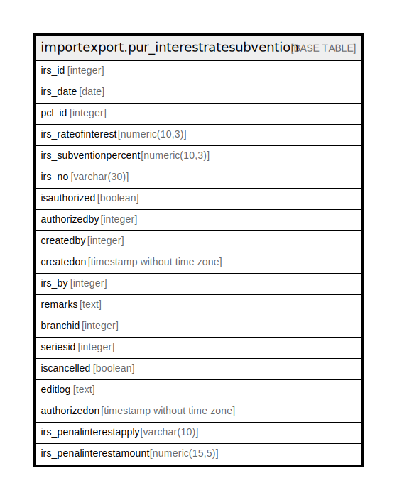

# importexport.pur_interestratesubvention

## Description

## Columns

| Name | Type | Default | Nullable | Children | Parents | Comment |
| ---- | ---- | ------- | -------- | -------- | ------- | ------- |
| irs_id | integer | nextval('importexport.pur_interestratesubvention_irs_id_seq'::regclass) | false |  |  |  |
| irs_date | date |  | false |  |  |  |
| pcl_id | integer |  | false |  |  |  |
| irs_rateofinterest | numeric(10,3) |  | true |  |  |  |
| irs_subventionpercent | numeric(10,3) |  | true |  |  |  |
| irs_no | varchar(30) |  | false |  |  |  |
| isauthorized | boolean | false | true |  |  |  |
| authorizedby | integer |  | true |  |  |  |
| createdby | integer |  | true |  |  |  |
| createdon | timestamp without time zone | now() | true |  |  |  |
| irs_by | integer |  | true |  |  |  |
| remarks | text |  | true |  |  |  |
| branchid | integer |  | true |  |  |  |
| seriesid | integer |  | true |  |  |  |
| iscancelled | boolean | false | true |  |  |  |
| editlog | text |  | true |  |  |  |
| authorizedon | timestamp without time zone |  | true |  |  |  |
| irs_penalinterestapply | varchar(10) |  | true |  |  |  |
| irs_penalinterestamount | numeric(15,5) |  | true |  |  |  |

## Constraints

| Name | Type | Definition |
| ---- | ---- | ---------- |
| pur_interestratesubvention_pkey | PRIMARY KEY | PRIMARY KEY (irs_id) |

## Indexes

| Name | Definition |
| ---- | ---------- |
| pur_interestratesubvention_pkey | CREATE UNIQUE INDEX pur_interestratesubvention_pkey ON importexport.pur_interestratesubvention USING btree (irs_id) |

## Relations

---

> Generated by [tbls](https://github.com/k1LoW/tbls)
