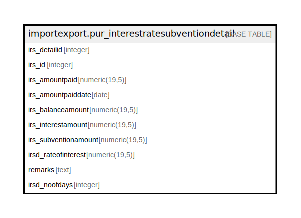

# importexport.pur_interestratesubventiondetail

## Description

## Columns

| Name | Type | Default | Nullable | Children | Parents | Comment |
| ---- | ---- | ------- | -------- | -------- | ------- | ------- |
| irs_detailid | integer | nextval('importexport.pur_interestratesubventiondetail_irs_detailid_seq'::regclass) | false |  |  |  |
| irs_id | integer |  | false |  |  |  |
| irs_amountpaid | numeric(19,5) |  | true |  |  |  |
| irs_amountpaiddate | date |  | true |  |  |  |
| irs_balanceamount | numeric(19,5) |  | true |  |  |  |
| irs_interestamount | numeric(19,5) |  | true |  |  |  |
| irs_subventionamount | numeric(19,5) |  | true |  |  |  |
| irsd_rateofinterest | numeric(19,5) |  | true |  |  |  |
| remarks | text |  | true |  |  |  |
| irsd_noofdays | integer |  | true |  |  |  |

## Constraints

| Name | Type | Definition |
| ---- | ---- | ---------- |
| pur_interestratesubventiondetail_pkey | PRIMARY KEY | PRIMARY KEY (irs_detailid) |

## Indexes

| Name | Definition |
| ---- | ---------- |
| pur_interestratesubventiondetail_pkey | CREATE UNIQUE INDEX pur_interestratesubventiondetail_pkey ON importexport.pur_interestratesubventiondetail USING btree (irs_detailid) |

## Relations

---

> Generated by [tbls](https://github.com/k1LoW/tbls)
