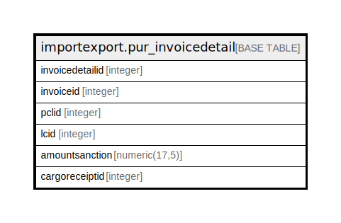

# importexport.pur_invoicedetail

## Description

## Columns

| Name | Type | Default | Nullable | Children | Parents | Comment |
| ---- | ---- | ------- | -------- | -------- | ------- | ------- |
| invoicedetailid | integer | nextval('importexport.pur_invoicedetail_invoicedetailid_seq'::regclass) | false |  |  |  |
| invoiceid | integer |  | true |  |  |  |
| pclid | integer |  | true |  |  |  |
| lcid | integer |  | true |  |  |  |
| amountsanction | numeric(17,5) |  | true |  |  |  |
| cargoreceiptid | integer |  | true |  |  |  |

## Constraints

| Name | Type | Definition |
| ---- | ---- | ---------- |
| pur_invoicedetail_pkey | PRIMARY KEY | PRIMARY KEY (invoicedetailid) |

## Indexes

| Name | Definition |
| ---- | ---------- |
| pur_invoicedetail_pkey | CREATE UNIQUE INDEX pur_invoicedetail_pkey ON importexport.pur_invoicedetail USING btree (invoicedetailid) |

## Relations

---

> Generated by [tbls](https://github.com/k1LoW/tbls)
