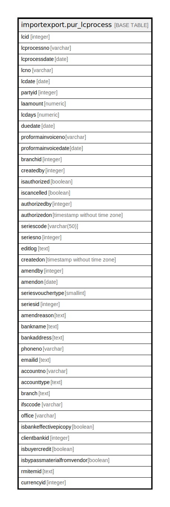

# importexport.pur_lcprocess

## Description

## Columns

| Name | Type | Default | Nullable | Children | Parents | Comment |
| ---- | ---- | ------- | -------- | -------- | ------- | ------- |
| lcid | integer | nextval('importexport.pur_lcprocess_lcid_seq'::regclass) | false |  |  |  |
| lcprocessno | varchar |  | false |  |  |  |
| lcprocessdate | date |  | false |  |  |  |
| lcno | varchar |  | false |  |  |  |
| lcdate | date |  | false |  |  |  |
| partyid | integer |  | false |  |  |  |
| laamount | numeric |  | true |  |  |  |
| lcdays | numeric |  | true |  |  |  |
| duedate | date |  | true |  |  |  |
| proformainvoiceno | varchar |  | true |  |  |  |
| proformainvoicedate | date |  | true |  |  |  |
| branchid | integer |  | true |  |  |  |
| createdby | integer |  | false |  |  |  |
| isauthorized | boolean | false | false |  |  |  |
| iscancelled | boolean | false | false |  |  |  |
| authorizedby | integer |  | true |  |  |  |
| authorizedon | timestamp without time zone |  | true |  |  |  |
| seriescode | varchar(50) |  | true |  |  |  |
| seriesno | integer |  | true |  |  |  |
| editlog | text |  | true |  |  |  |
| createdon | timestamp without time zone | now() | true |  |  |  |
| amendby | integer |  | true |  |  |  |
| amendon | date |  | true |  |  |  |
| seriesvouchertype | smallint | 0 | true |  |  |  |
| seriesid | integer |  | true |  |  |  |
| amendreason | text |  | true |  |  |  |
| bankname | text |  | true |  |  |  |
| bankaddress | text |  | true |  |  |  |
| phoneno | varchar |  | true |  |  |  |
| emailid | text |  | true |  |  |  |
| accountno | varchar |  | true |  |  |  |
| accounttype | text |  | true |  |  |  |
| branch | text |  | true |  |  |  |
| ifsccode | varchar |  | true |  |  |  |
| office | varchar |  | true |  |  |  |
| isbankeffectivepicopy | boolean | false | true |  |  |  |
| clientbankid | integer |  | true |  |  |  |
| isbuyercredit | boolean | false | true |  |  |  |
| isbypassmaterialfromvendor | boolean | false | true |  |  |  |
| rmitemid | text |  | true |  |  |  |
| currencyid | integer |  | true |  |  |  |

## Constraints

| Name | Type | Definition |
| ---- | ---- | ---------- |
| pur_lcprocess_pkey | PRIMARY KEY | PRIMARY KEY (lcid) |

## Indexes

| Name | Definition |
| ---- | ---------- |
| pur_lcprocess_pkey | CREATE UNIQUE INDEX pur_lcprocess_pkey ON importexport.pur_lcprocess USING btree (lcid) |

## Triggers

| Name | Definition |
| ---- | ---------- |
| lc_amend_log_entry | CREATE TRIGGER lc_amend_log_entry BEFORE UPDATE ON importexport.pur_lcprocess FOR EACH ROW EXECUTE FUNCTION importexport.lc_amend_log_entry() |

## Relations

---

> Generated by [tbls](https://github.com/k1LoW/tbls)
