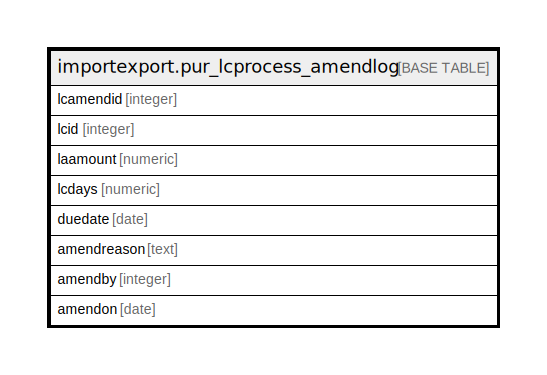

# importexport.pur_lcprocess_amendlog

## Description

## Columns

| Name | Type | Default | Nullable | Children | Parents | Comment |
| ---- | ---- | ------- | -------- | -------- | ------- | ------- |
| lcamendid | integer | nextval('importexport.pur_lcprocess_amendlog_lcamendid_seq'::regclass) | false |  |  |  |
| lcid | integer |  | true |  |  |  |
| laamount | numeric |  | true |  |  |  |
| lcdays | numeric |  | true |  |  |  |
| duedate | date |  | true |  |  |  |
| amendreason | text |  | true |  |  |  |
| amendby | integer |  | true |  |  |  |
| amendon | date |  | true |  |  |  |

## Constraints

| Name | Type | Definition |
| ---- | ---- | ---------- |
| pur_lcprocess_amendlog_pkey | PRIMARY KEY | PRIMARY KEY (lcamendid) |

## Indexes

| Name | Definition |
| ---- | ---------- |
| pur_lcprocess_amendlog_pkey | CREATE UNIQUE INDEX pur_lcprocess_amendlog_pkey ON importexport.pur_lcprocess_amendlog USING btree (lcamendid) |

## Relations

---

> Generated by [tbls](https://github.com/k1LoW/tbls)
