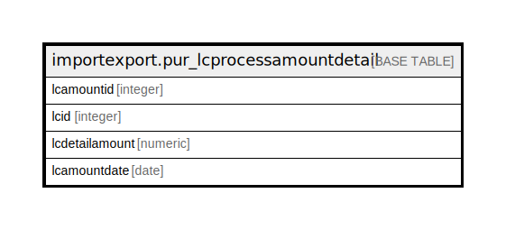

# importexport.pur_lcprocessamountdetail

## Description

## Columns

| Name | Type | Default | Nullable | Children | Parents | Comment |
| ---- | ---- | ------- | -------- | -------- | ------- | ------- |
| lcamountid | integer | nextval('importexport.pur_lcprocessamountdetail_lcamountid_seq'::regclass) | false |  |  |  |
| lcid | integer |  | true |  |  |  |
| lcdetailamount | numeric |  | true |  |  |  |
| lcamountdate | date |  | true |  |  |  |

## Constraints

| Name | Type | Definition |
| ---- | ---- | ---------- |
| pur_lcprocessamountdetail_pkey | PRIMARY KEY | PRIMARY KEY (lcamountid) |

## Indexes

| Name | Definition |
| ---- | ---------- |
| pur_lcprocessamountdetail_pkey | CREATE UNIQUE INDEX pur_lcprocessamountdetail_pkey ON importexport.pur_lcprocessamountdetail USING btree (lcamountid) |

## Relations

---

> Generated by [tbls](https://github.com/k1LoW/tbls)
