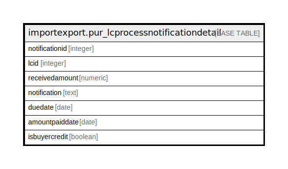

# importexport.pur_lcprocessnotificationdetail

## Description

## Columns

| Name | Type | Default | Nullable | Children | Parents | Comment |
| ---- | ---- | ------- | -------- | -------- | ------- | ------- |
| notificationid | integer | nextval('importexport.pur_lcprocessnotificationdetail_notificationid_seq'::regclass) | false |  |  |  |
| lcid | integer |  | true |  |  |  |
| receivedamount | numeric |  | true |  |  |  |
| notification | text |  | true |  |  |  |
| duedate | date |  | true |  |  |  |
| amountpaiddate | date |  | true |  |  |  |
| isbuyercredit | boolean | false | true |  |  |  |

## Constraints

| Name | Type | Definition |
| ---- | ---- | ---------- |
| pur_lcprocessnotificationdetail_pkey | PRIMARY KEY | PRIMARY KEY (notificationid) |

## Indexes

| Name | Definition |
| ---- | ---------- |
| pur_lcprocessnotificationdetail_pkey | CREATE UNIQUE INDEX pur_lcprocessnotificationdetail_pkey ON importexport.pur_lcprocessnotificationdetail USING btree (notificationid) |

## Relations

---

> Generated by [tbls](https://github.com/k1LoW/tbls)
