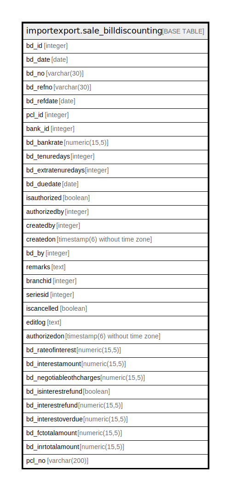

# importexport.sale_billdiscounting

## Description

## Columns

| Name | Type | Default | Nullable | Children | Parents | Comment |
| ---- | ---- | ------- | -------- | -------- | ------- | ------- |
| bd_id | integer | nextval('importexport.sale_billdiscounting_bd_id_seq'::regclass) | false |  |  |  |
| bd_date | date |  | false |  |  |  |
| bd_no | varchar(30) |  | false |  |  |  |
| bd_refno | varchar(30) |  | true |  |  |  |
| bd_refdate | date |  | true |  |  |  |
| pcl_id | integer |  | false |  |  |  |
| bank_id | integer |  | false |  |  |  |
| bd_bankrate | numeric(15,5) |  | true |  |  |  |
| bd_tenuredays | integer |  | true |  |  |  |
| bd_extratenuredays | integer |  | true |  |  |  |
| bd_duedate | date |  | true |  |  |  |
| isauthorized | boolean | false | true |  |  |  |
| authorizedby | integer |  | true |  |  |  |
| createdby | integer |  | true |  |  |  |
| createdon | timestamp(6) without time zone | now() | true |  |  |  |
| bd_by | integer |  | true |  |  |  |
| remarks | text |  | true |  |  |  |
| branchid | integer |  | true |  |  |  |
| seriesid | integer |  | true |  |  |  |
| iscancelled | boolean | false | true |  |  |  |
| editlog | text |  | true |  |  |  |
| authorizedon | timestamp(6) without time zone |  | true |  |  |  |
| bd_rateofinterest | numeric(15,5) |  | true |  |  |  |
| bd_interestamount | numeric(15,5) |  | true |  |  |  |
| bd_negotiableothcharges | numeric(15,5) |  | true |  |  |  |
| bd_isinterestrefund | boolean |  | true |  |  |  |
| bd_interestrefund | numeric(15,5) |  | true |  |  |  |
| bd_interestoverdue | numeric(15,5) |  | true |  |  |  |
| bd_fctotalamount | numeric(15,5) |  | true |  |  |  |
| bd_inrtotalamount | numeric(15,5) |  | true |  |  |  |
| pcl_no | varchar(200) |  | true |  |  |  |

## Constraints

| Name | Type | Definition |
| ---- | ---- | ---------- |
| sale_billdiscounting_pkey | PRIMARY KEY | PRIMARY KEY (bd_id) |

## Indexes

| Name | Definition |
| ---- | ---------- |
| sale_billdiscounting_pkey | CREATE UNIQUE INDEX sale_billdiscounting_pkey ON importexport.sale_billdiscounting USING btree (bd_id) |

## Relations

---

> Generated by [tbls](https://github.com/k1LoW/tbls)
